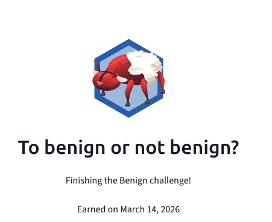

## Day 100
### [**Streak**](https://tryhackme.com/Tushig3531/streak)
---
**Room Completed**
[**ItsyBitsy**](https://tryhackme.com/room/itsybitsy)
[**Benign**](https://tryhackme.com/room/benign)

---

To learn more deeply, I started writing everything down to get a better understanding.
Today, based on yesterday’s study session, I worked on practicing SIEM tools: Elastic and Splunk. These two rooms gave me real-life scenarios, and I was able to figure out where the issues and malicious activities were by tracing them through the company logs. It was really good practice with SIEM, and I also finished the SIEM Triage for SOC room.

---

