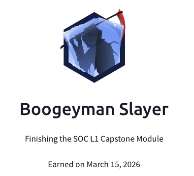

## Day 101
### [**Streak**](https://tryhackme.com/Tushig3531/streak)
---
**Room Completed**
[**Tempest**](https://tryhackme.com/room/tempestincident)
[**Boogeyman 1**](https://tryhackme.com/room/boogeyman1)
[**Boogeyman 2**](https://tryhackme.com/room/boogeyman2)
[**Boogeyman 3**](https://tryhackme.com/room/boogeyman3)

---

To learn more deeply, I started writing everything down to get a better understanding.
Today, I completed the entire SOC Level 1 course and worked on four intensive practice rooms. Throughout these rooms, I applied all the knowledge I gained from the course and experienced real-world scenarios as a SOC analyst. It was extremely difficult to answer all the questions, but after 12 hours of struggle, I managed to complete them all. All of the rooms required me to detect malicious activities using Wireshark, SIEM, phishing analysis, and network analysis. Working with all of them in a single case was challenging, but I pushed through, and I am grateful that I finished the course.

---

