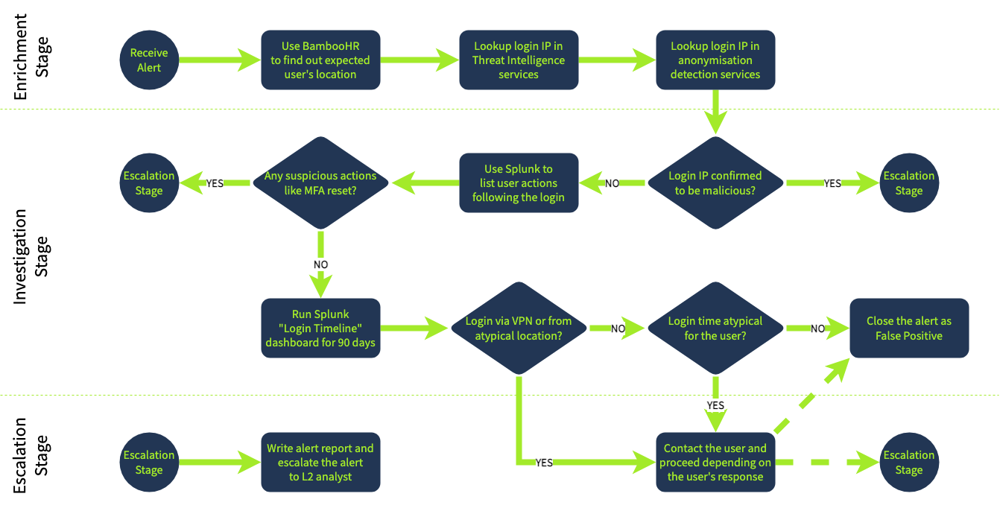

## Day 51
### [**Streak**](https://tryhackme.com/Tushig3531/streak)
---
**Room Completed**
[**SOC Workbooks and Lookups**](https://tryhackme.com/room/socworkbookslookups)
[**SOC Metrics and Objectives**](https://tryhackme.com/room/socmetricsobjectives)
---

Enrichment : Use Threat Intelligence and identity inventory to get information about the affected user
Investigation : Using the gathered data and SIEM logs, make your verdict if the login is expected
Escalation : Escalate the alert to L2 or communicate the login with user if necessary
---
Mean Time to Detect (MTTD) : 5 minutes : Average time between the attack and its detection by SOC tools
Mean Time to Acknowledge (MTTA) : 10 minutes : Average time for L1 analysts to start triage of the new alert
Mean Time to Respond (MTTR) : 60 minutes : Average time taken by SOC to actually stop the breach from spreading
---
False Positive Rate over 80% : receives too much noise
- Make sure our EDR/SIEM ignores safe system updates
- Use SOAR or scripts to auto-handle our most common alerts

Mean Time to Detect over 30 min: detects with a high delay
- Contact SOC engineer to make the detection rules run faster or with a higher rate
- Check if SIEM logs are collected in real-time, without a 10 minute delay

Mean Time to Acknowledge over 30 min : L1 analysts start alert triage with a high delay
- Ensure the analysts are notified in real-time when a new alert appears
- Try to evenly distribute alerts in the queu between the analysts on shift

Mean Time to Respond over 4 hours : SOC team can't stop the breach in time
- As L1, make everything possible to quickly escalate the threats to L2
- Ensure our team has documented what to do during different attack scenarios

