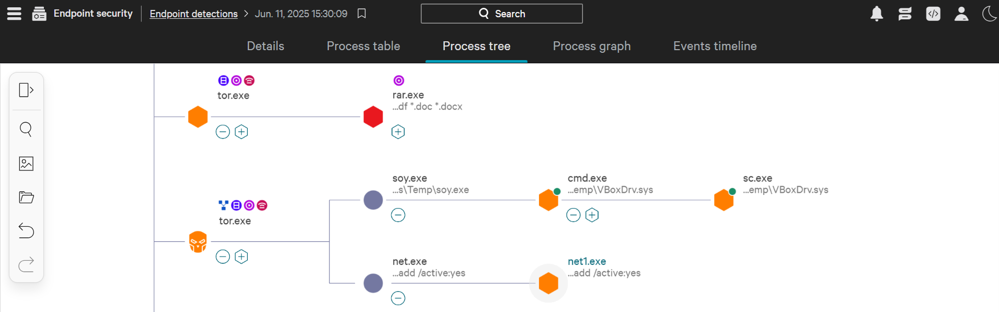
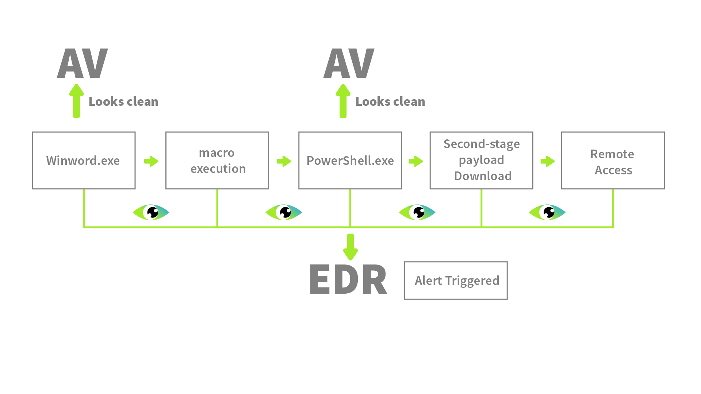

## Day 53
### [**Streak**](https://tryhackme.com/Tushig3531/streak)
---
**Room Completed**
[**Introduction to EDR**](https://tryhackme.com/room/introductiontoedrs)
[**SOC Metrics and Objectives**](https://tryhackme.com/room/socmetricsobjectives)
---

Endpoint Detection and Response (EDR) is a security solution designed to monitor, detect, and respond to advanced threats at the endpoint level.
No matter where the endpoints are, the EDR will make sure they are monitored constantly and threats are detected.
There are three main features of an EDR:
- Visibility : **It collects detailed data from the endpoints**, which includes process modifications, registry modifications, file and folder modifications, user actions, and much more. It **then presents this information in a very structured format** to the analyst. The analyst can see the whole process **tree with a complete activity timeline of the sequence of actions**. The analyst can also access the **historical data** of any endpoint for threat hunting or any other purpose. 

- Detection : It **incorporates signature-based detections** as well as behavior-based detections. It can also **detect fileless malware that resides in memory**. It also allows us to feed custom IOCs for threat detections.

- Response 

The Antivirus (AV) may detect some basic threats, but to detect advanced threats that evade normal detections, we need an EDR. Unlike antivirus software's basic signature-based detection, it monitors and records the behaviors of the endpoint.

.
---
Agents : Sometimes referred to as sensors.
Telemetry : Is the black box of an endpoint with everything necessary for detection and investigation

Detailed telemetry not only helps the EDR detect advanced threats and make better judgments on the legitimacy of the activities, but it is also very helpful for the analysts during the investigations.

### Advanced Techniques
**Detection**
- Behavioral Detection :  matching the signatures with known threats
- Anomaly Detection : any activity that deviates from this behavior will be flagged
- IOC matching : flags any activity that matches any known IOC : Example: A user downloads a file that drops an executable. The executable is often used in a specific attack. The hash of this executable will get matched with the threat intelligence feed and instantly flagged by the EDR
- MITRE ATT&CK Mapping : marks the malicious or suspicious but also mapped with the MITRE Tactic and Technique 
- Machine Learning Algorithms

**Response**
- Isolate Host
- Terminate Process
- Quarantine
- Remote Access
- Artefacts Collection : extract important artefacts from the endpoints without physically accessing the device

