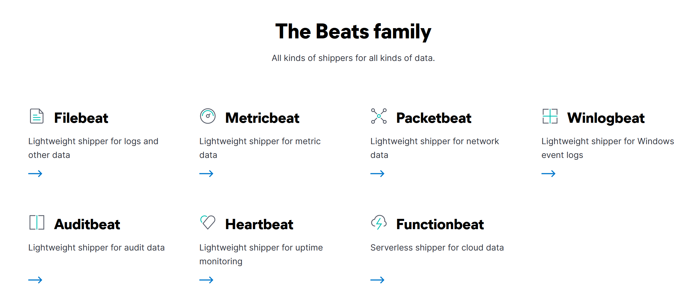

## Day 55
### [**Streak**](https://tryhackme.com/Tushig3531/streak)
---
**Room Completed**
[**Elastic Stack: The Basics**](https://tryhackme.com/room/investigatingwithelk101)
---
Elastic Stack (ELK) :
- used for log analysis and investigations and use it as data searching and visualizing capability
- originally developed to store, search, and visualize large amounts of data

Elastic Stack is a collection of different open-source components that work together to collect data from any source, store and search it, and visualize it in real time. 

**Core components**
**ElasticSearch**
- it is a full-text search and analytics engine for JSON-formatted documents. It stores, analyzes, and correlates data and supports a RESTful API for interacting with it.

**LogStash**
- it is a data processing engine that takes data from different sources, filters it, or normalize it, and then sends it to destination. It has three main parts: Input, Filter, Output

**Beats**
- Beats are host-based agents kown as data-shippers that ship or transfer data from the endpoints to ElasticSearch. And each beat is a single-purpose agent that send specific data to ElasticSearch.

**Kibana**
- Kibana is a web-based data visualization tool that works with ElasticSearch to analyze, investigate, and visualize data streams in real time. 

This is how it works together:
- Beats collects data from multiple agents.
- LogStash gets data from Beats, ports, or files parses or normalizes it into field value pairs, and stores them in ElasticSearch
- ElasticSearch acts as a database used to search and analyze data
- Kibana is responsible for displaying and visualizing the data stored in Elasticsearch
.
---
Discover Tab : shows the ingested logs, the search bar, normalized fields, and more.

With KQL, we can search for the logs in two different ways:
- Free text search : Search with the exact name with quotation marks
- Field-based search : select the search field and able to search
Logical Operators (AND | OR | NOT)

