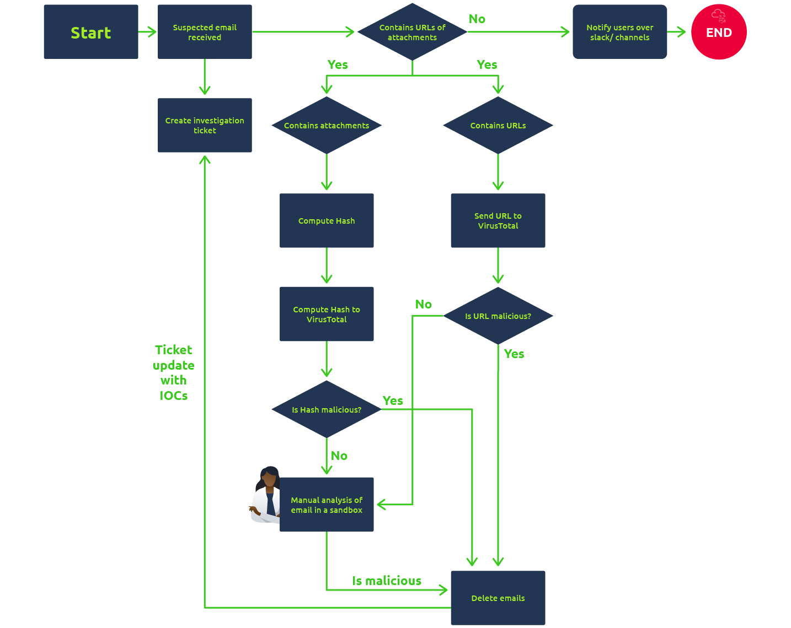
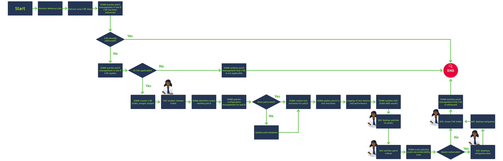

## Day 56
### [**Streak**](https://tryhackme.com/Tushig3531/streak)
---
**Room Completed**
[**Introduction to SOAR**](https://tryhackme.com/room/soar)
---
Security Orchestration, Automation, and Response (SOAR)

**Challenges Faced by SOC**
- Alert Fatique : Using numerous security tools triggers a large number of alerts within an SOC. Many of these alerts are false positives or insufficient for an investigation, leaving analysts overwhelmed and unable to address any serious security events.
- Too Many Disconnected Tools : Security tools often deployed without integration within an organisation. Security teams are tasked with navigating through firewall logs and rules, which are handled independently from endpoint security logs. This also leads to an overload of tools.
- Manual Processes : SOC investigation procedures are often not documented, leading to inefficient means of addressing threats. Most rely on established tribal knowledge built by experienced analysts, and the processes are never documented. This results in slowing down the investigation and increasing response times.
- Talent Shortage : SOC teams find recruiting and expanding their talent pool difficult to address the growing security landscape and sophisticated threats. Combining this with the alert overload teams face, security analysts become more overwhelmed with the responsibilities they have to undertake, resulting in less efficient work and extended incident response times that allow adversaries to wreak havoc within an organisation.
.
---
Security Orchestration, Automation, and Response (SOAR) is a tool that unifies all the security tools used in a SOC. Analysts do not need to switch between SIEM, EDR, Firewall, other tools for investigation. All of them are in one interface (SOAR). Also it provides ticketing and case management to the analysts.

SOAR comes from 3 main capabilities:
**Orchesration** : It connects different tools from various vendors within the unified SOAR interface. It defines workflows for investigating various types of alerts, as Playbooks. These playbooks are predefined steps that tell the SOAR how to investigate an alert.
For example:
- Received alert from SIEM
- Query SIEM to check if the User normally uses the IP
- Check TI platforms for the IP's reputation 
- Query SIEM for any successful logins 
- Escalate to containment actions

**Automation** : Through predefined actions (Playbooks), can be automated
For example:
- SOAR receives the alert from SIEM
- It automatically queries the SIEM for the user's historical logins
- It automatically verifies the IP's reputation through TI platforms
- If the IP is malicious, it automatically disables the user from the IAM
- Lastly, it automatically opens a ticket in the ticketing system with all the details to initiate an   investigation

**Response**

The Orchestration, Automation and Response, SOAR solves the challanges: There is no more alert fatique, most of the processes are automated, and all the different tools are connected for coordination.
---

Phishing Playbook :  SOAR solutions can execute these tasks in the background via a playbook. And, remediation can be performed when a positive phishing email is identified.

- It creates ticket first
- Checks it
- if clear, notify users over channels, and end
- if not clear, delete, and create ticket

CVE Patching Playbook : As part of vulnerability management, the SOC team has to address newly released CVEs by verifying whether they exist in their network and patching them if they do.  An analyst must always be on the lookout for publications on new CVEs and remediation plans. The process can become overwhelming, resulting in a mounting backlog and patches not being applied, leaving the environment more vulnerable. Moreover, this process can take a lot of time and resources of the SOC team since CVEs are released frequently. So, to solve this problem, we can make a playbook for handling the CVEs inside the SOAR tool, just like we did for the phishing case.

