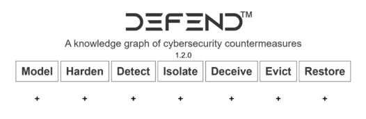

## Day 60
### [**Streak**](https://tryhackme.com/Tushig3531/streak)
---
**Room Completed**
[**MITRE**](https://tryhackme.com/room/mitre)
---
The **MITRE ATT&CK® framework is “a globally-accessible knowledge base of adversary tactics and techniques based on real-world observations**. The ATT&CK knowledge base is used as a foundation for the development of specific threat models and methodologies in the private sector, in government, and in the cyber security product and service community.”
| Who | Their Goal | How They Use ATT&CK |
|:--|:--|:--|
| Cyber Threat Intelligence (CTI) Teams | Collect and analyze threat information to improve an organization's security posture | Map observed threat actor behavior to ATT&CK TTPs to create profiles that are actionable across the industry |
| SOC Analysts | Investigate and triage security alerts | Link activity to tactics and techniques to provide detailed context for alerts and prioritize incidents |
| Detection Engineers | Design and improve detection systems | Map SIEM/EDR and other rules to ATT&CK to ensure better detection efforts |
| Incident Responders | Respond to and investigate security incidents | Map incident timelines to MITRE tactics and techniques to better visualize the attack |
| Red & Purple Teams | Emulate adversary behavior to test and improve defenses | Build emulation plans and exercises aligned with techniques and known group operations |

MITRE defines the Cyber Analytics Repository (CAR) as “a knowledge base of analytics developed by MITRE based on the MITRE ATT&CK adversary model. CAR defines a data model that is leveraged in its pseudocode representations, but also includes implementations directly targeted at specific tools (e.g., Splunk, EQL) in its analytics. With respect to coverage, CAR is focused on providing a set of validated and well-explained analytics, in particular with regard to their operating theory and rationale.”

So, which means basically CAR is a collection of ready-made detection analytics built around ATT&CK. Each analytic describes how to detect an adversary's behavior. This is key because it allows you to identify the patterns you should look for as a defender. CAR also provides example queries for common industry tools such as Splunk, so you, as a defender, can translate ATT&CK TTPs into real detections. 

In the Implementations section, you are provided with Pseudocode, a Splunk query, and a LogPoint search as examples of how an analyst may filter for this technique using their organization's Security Information and Event Management (SIEM) platform.

**MITRE D3FEND : Is for how to defend**
D3FEND (Detection, Denial, and Disruption Framework Empowering Network Defense) is a structured framework that maps out defensive techniques and establishes a common language for describing how security controls work. D3FEND comes with its own matrix, which is broken down into seven tactics, each with its associated techniques and IDs.

- Emulation Plans : primarily maintained and contributed to by The Center for Threat Informed Defense (CTID), is a free resource of adversary emulation plans. The library currently contains several emulations that mimic real-world attacks by known threat groups. The emulation plans are a step-by-step guide on how to mimic the specific threat group. 

- Caldera : is an automated adversary emulation tool designed to help security teams test and enhance their defenses. It provides the ability to simulate real-world attacker behavior utilizing the ATT&CK framework. This allows defenders to evaluate detection methods and practice incident response in a controlled environment. Caldera supports offensive and defensive operations, making it a powerful tool for red and blue team exercises.

