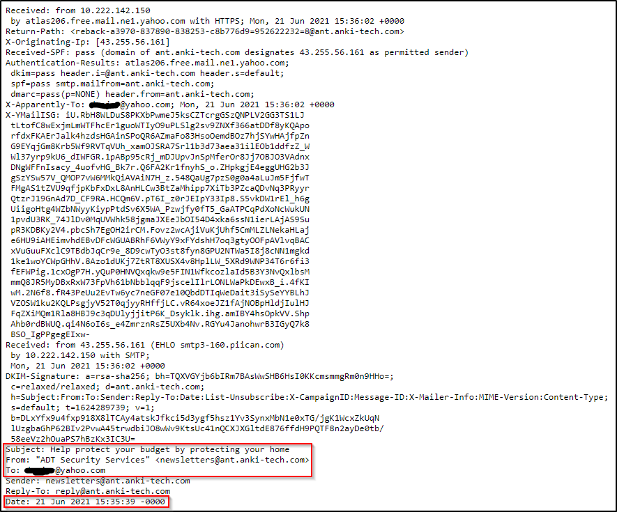

## Day 62
### [**Streak**](https://tryhackme.com/Tushig3531/streak)
---
**Room Completed**
[**Phishing Analysis Fundamentals**](https://tryhackme.com/room/phishingemails1tryoe)
---
- SMTP (Simple Mail Transfer Protocol) - It is utilized to handle the sending of emails. 
- POP3 (Post Office Protocol) - Is responsible transferring email between a client and a mail server. 
- IMAP (Internet Message Access Protocol) - Is responsible transferring email between a client and a mail server. 

Port 587 with STARTTLS is recommended.
- Port 587 : Insecure Transport (Upgraded to a secure connection using STARTTLS)
| **Server/Port**        | **POP**                        | **IMAP**                       |
|------------------------|--------------------------------|--------------------------------|
| **Incoming hostname**  | pop.dreamhost.com              | imap.dreamhost.com             |
| **Secure Port**        | Port 995 (SSL enabled)         | Port 993 (SSL enabled)         |
| **Insecure Port**      | Port 110 (SSL not enabled)     | Port 143 (SSL not enabled)     |

**Raw**

We are able to see the HTML of the email as well
Warning: When interacting with attachments, proceed with caution and make sure you don't double-click an email's attachment by accident. 

- Spam - unsolicited junk emails sent out in bulk to a large number of recipients. The more malicious variant of Spam is known as MalSpam.
- Phishing -  emails sent to a target(s) purporting to be from a trusted entity to lure individuals into providing sensitive information. 
- Spear phishing - takes phishing a step further by targeting a specific individual(s) or organization seeking sensitive information.  
- Whaling - is similar to spear phishing, but it's targeted specifically to C-Level high-position individuals (CEO, CFO, etc.), and the objective is the same. 
- Smishing - takes phishing to mobile devices by targeting mobile users with specially crafted text messages. 
- Vishing - is similar to smishing, but instead of using text messages for the social engineering attack, the attacks are based on voice calls. 

