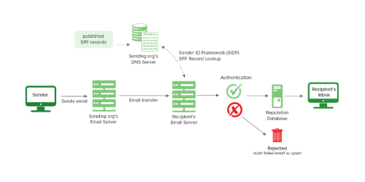
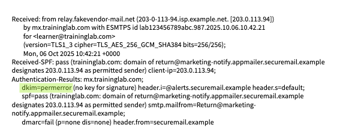
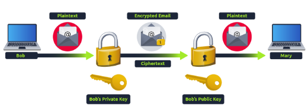

## Day 64
### [**Streak**](https://tryhackme.com/Tushig3531/streak)
---
**Room Completed**
[**Phishing Prevention**](https://tryhackme.com/room/phishingemails4gkxh)
---
### SPF
**Sender Policy Framework (SPF)** : is used to authenticate the sender of an email. With SPF record in place, Internet Service Providers can verify that a mail server is authorized to send email for a specific domain. An SPF record is a DNS TXT record containing a list of the IP addresses that are allowed to send email on behalf of our domain.

When an email is sent, the **receiving mail server checks the domain's SPF record to verify whether the sending server is authorized to send messages** on behalf of that domain. The delivery of the email (intended action) is based on the result of the SPF record verification.

Pass, Neutral, None --> Accept
SoftFail, PermError	 --> Flag (Mark as suspicious but allow)
Fail, TempError	--> Reject (Immediately discard the email)

```bash
v=spf1 ip4:127.0.0.1 include:_spf.google.com -all
```
- v=spf1 Signifies the start of the SPF record
- ip4:127.0.0.1 Specifies which IP can send mail (IPv4 in this case)
- include:_spf.google.com Specifies which domain can send mail
- -all Non-authorized emails will be rejected

Basically, SPF = rule set that says which servers are allowed to send mail for this domain; if the sending server isn’t allowed, SPF fails
And the domain owner has to configure the SPF record to list which servers or services are allowed to send email for their domain. That way, other mail servers can detect and block spoofed emails that try to impersonate that domain.
.
---
### DKIM
DKIM = DomainKeys Identified Mail
It’s an email authentication method: a way for the receiving mail server (like Gmail, Outlook, etc.) to check,
- “Did this message really come from example.com, and has it been tampered with?”
It’s similar to SPF (Sender Policy Framework), and both can be used by DMARC, which is a policy layer that says what to do if SPF/DKIM checks fail (reject, quarantine, or do nothing).

**How DKIM works**
So basically it works like a key exchange:
- My email server has a private key
- My domain’s DNS has a matching public key
So when I send a message or someone sends one to me, they (or I) use a private key to encrypt part of the email and create a digital signature. When the receiver gets the email, they use the public key to verify that it really came from the claimed sender. If it doesn’t match, DKIM results in a failure such as fail, permerror, or another error.

It is a defense against email **spoofing**, which is one technique heavily used in phishing.
- Spoofing = sending an email that pretends to be from support@yourbank.com when it’s really from some random server the attacker owns.

So, DKIM provides : Integrity and Domain Authentication

**Components**
```bash
v=DKIM1; k=rsa; p=<public_key>
```
- v=DKIM1 Specifies the version of DKIM being used (optional)
- k=rsa The key type. The RSA encryption algorithm is standard
- p= This is the public key that will be matched to the private key to verify the DKIM signature

Example: 

.
---
### DMARC
DMARC = Domain-Based Message Authentication, Reporting, and Conformance
An open source standard, uses a concept called alignment to tie the result of two other open source standards,  SPF (a published list of servers that are authorized to send email on behalf of a domain) and DKIM (a tamper-evident domain seal associated with a piece of email), to the content of an email.”
- Ensures the sender's domain matches the domains verified by SPF and DKIM

**Components**
```bash 
v=DMARC1; p=quarantine; rua=mailto:postmaster@website.com
```
- v=DMARC1: The version of DMARC (required)
- p=quarantine The DMARC policy (quarantine = move to the spam folder)
- rua=mailto:postmaster@website.com An optional tag. In this case, aggregate reports will be sent to the email specified
.
---
### S/MIME
S/MIME = Secure/Multipurpose Internet Mail Extensions
Using Public Key Cryptography, S/MIME guarantees data integrity and non-repudiation. 

.


