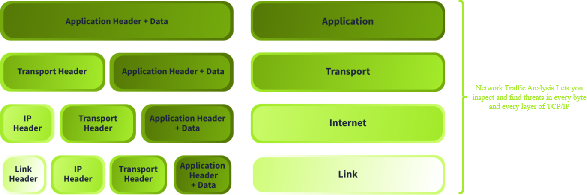
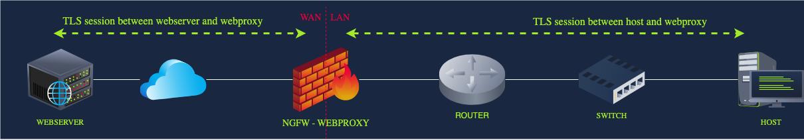
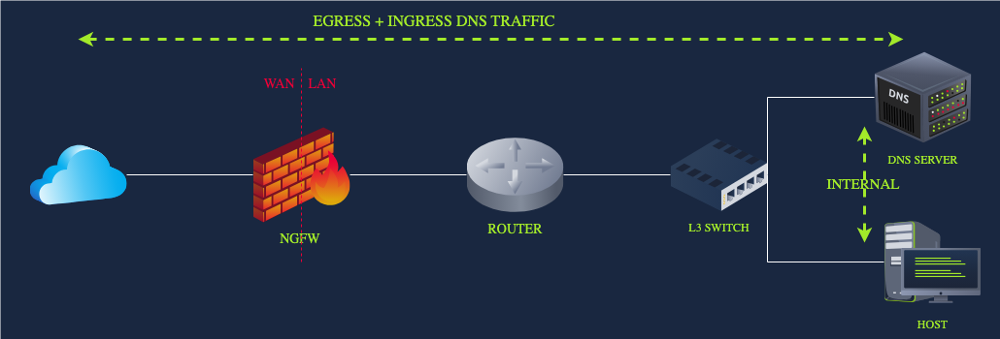
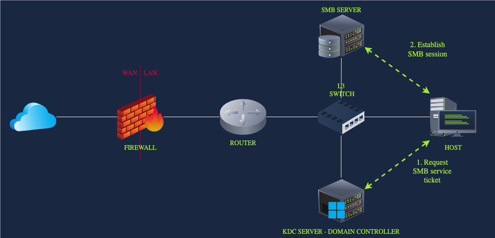

## Day 68
### [**Streak**](https://tryhackme.com/Tushig3531/streak)
---
**Room Completed**
[**Network Traffic Basics**](https://tryhackme.com/room/networktrafficbasics)
---
Network Traffic Analysis (NTA) is a process that encompasses capturing, inspecting, and analyzing data as it flows in a network
- Its goal is to have complete visibility and understand what is communicated inside and outside the network
 As an L1 analyst, we need to be able to navigate through the sea of network information and understand what is normal and what deviates from the baseline.


 Domain Name System (DNS) is the protocol responsible for resolving hostnames, such as tryhackme.com, to their respective IP addresses.

DNS log:
2025-10-03 09:15:23    SRC=192.168.1.16      QUERY=aj39skdm.malicious-tld.com    QTYPE=A      
2025-10-03 09:15:31    SRC=192.168.1.16      QUERY=msd91azx.malicious-tld.com    QTYPE=A     
2025-10-03 09:15:45    SRC=192.168.1.16      QUERY=cmd01.malicious-tld.com       QTYPE=TXT     
2025-10-03 09:15:45    SRC=192.168.1.16      QUERY=cmd01.malicious-tld.com       QTYPE=TXT     

We can understand that:
- Query and querytype
- Subdomain and top-level domain: We can check tools like abuseDB or VirusTotal to check if the domain is malicious
- Host IP: We can identify the system sending out the DNS queries
- Destination IP: We can use tools like AbuseIPDB or VirusTotal to verify if the IP is flagged as malicious
- Timestamp: We can build a timeline mapping out the different suspicious queries
The DNS logs don't contain more information than this
We will need to inspect the DNS traffic more thoroughly and check the content of the DNS queries and replies. This will allow us to determine the nature of these queries and replies. 

**So why should we analyse network traffic**
1. Network analysis:
- Monitor network performance
- Check for abnormalities in the network. Sudden performance preaks, slow network
- Inspect the content of suspicious communication internally and externally. Exfiltration via DNS, download of a malicious ZIP file ocer HTTP, etc
2. SOC perspective, network traffic analysis:
- Detecting suspicious or malicious activity
- Reconstructing attack during incident response
- Verify and validating alerts

Importance of network traffic analysis:
- Based on the logs for a end-user-system, the system began to deviate from its normal behavious around 4pm UTC. Analyzing the network traffic going to and from this system, we found a suspicious HTTP request and were able to extract the suspcious ZIP-file
- We received an alert that an end-user systm is sending many DNS requests in comparison to baseline of the network. After inspecting the DNS requests, we discovered that data was being exfiltrated using a techniqu calld DNS tunnling

### What network traffic can we observed?

Each layer describes the required information to pass the data to the next layer.

**Application**
On the application layer, we can find two important information structures: the application header information and application data itself. This information will change depending on which application layer protocol is used. 
- From the GET request, we can determine that the client is requesting a file named "suspicious_package.zip". The server's response includes a 200 code, which means the request was accepted. 
```bash
GET /downloads/suspicious_package.zip HTTP/1.1
Host: www.tryhackrne.thn
User-Agent: curl/7.85.0
Accept: */*
Connection: close
```
```bash
HTTP/1.1 200 OK
Date: Mon, 29 Sep 2025 10:15:30 GMT
Server: nginx/1.18.0
Content-Type: application/zip
Content-Length: 10485760
Content-Disposition: attachment; filename="suspicious_package.zip"
Last-Modified: Mon, 29 Sep 2025 09:54:00 GMT
ETag: "5d8c72-9f8a1c-3a2b4c"
Accept-Ranges: bytes
Connection: close
```
**Transport**
The application data and header are segmented and enxapsulated at the transport layer into smaller pieces. Each pieceincludes a transport header, in most cases TCP orUDP. Firewall log entries:
```nginx
2025-10-13 09:15:32 ACCEPT TCP src=192.168.1.45 dst=172.217.22.14 sport=51432 dport=443 flags=SYN len=60
2025-10-13 09:15:32 ACCEPT TCP src=172.217.22.14 dst=192.168.1.45 sport=443 dport=51432 flags=SYN,ACK len=60
```
Firewall logs often include the source and destination ports and the flags, but all the other fields are often not included. Session hijacking can be detected by analyzing the sequence numbers included in the header. If the sequence numbers are suddenly far apart, further investigation is warranted. 
```bash
No.     Time        Source          Destination     Protocol Length  Info
1       0.000000    192.168.1.45    172.217.22.14   TCP      74      51432 → 80 [SYN] Seq=0 Win=64240 Len=0 MSS=1460
2       0.000120    172.217.22.14   192.168.1.45    TCP      74      80 → 51432 [SYN, ACK] Seq=0 Ack=1 Win=65535 Len=0 MSS=1460
3       0.000220    192.168.1.45    172.217.22.14   TCP      66      51432 → 80 [ACK] Seq=1 Ack=1 Win=64240 Len=0
4       0.010500    192.168.1.45    172.217.22.14   TCP      1514    51432 → 80 [PSH, ACK] Seq=1 Ack=1 Win=64240 Len=1460
5       0.010620    172.217.22.14   192.168.1.45    TCP      66      80 → 51432 [ACK] Seq=1 Ack=1461 Win=65535 Len=0
6       0.020100    192.168.99.200  172.217.22.14   TCP      74      51432 → 80 [PSH, ACK] Seq=34567232 Ack=1 Win=64240 Len=20  
```
Sequence --> 0 and 1 to 34567232 is suspicious
- The first 3 lines show a normal TCP 3-way handshake : Sending source to destination [SYN]; Sending back from destination to source [SYN, ACK]; and Sending back again from source to destination [ACK]. 

[SYN] : basically means that "I want to communicate and here is my initial sequence number"
[SYN, ACK] : basically means "I accept the request and acknowledges"
[ACK] : basically means that "I received your packet and expect the net sequence number"
Purpose : Estabilish a reliable connection between client and server, Synchronize sequence numbers for both sides, Comfirm both devices are reachable and ready to send and receive data, Prevent old or duplicate connection requests from causing problems
- Lines 4 and 5 show legitimate data transfer
[PSH] (Push) : Tells the receiver to immediately deliver the data to the application
[ACK] : Confrims that the sender has successfully received previous data
[PSH, ACK] : basically means: "I have received your data, and here is new data that should be processed immediately"
- Line 6 shows a packet from another source trying to inject itself into the session

WIN : TCP window size is used for flow control, determining how much data can be sent before acknowledgment is required.

**Internet**
When the transport layer sendsdown a segment, the internet layer also adds its header. If the segment is larger than the Maximum Transmission Unit (MTU), it will be divided into fragments, and a header will be added to each of them. The fileds that are most often logged are the source and destination IP and TTL. To detect fragmentation attacks, we will need to inspect the fragment offsetand total length fields as well. 
Fragmentation attacl:
- An attacker can create tiny gragments to evade the IDS or mess up the reassembly of fragments by using overlapping byte ranges. 
```bash
No.   Time       Source        Destination   Protocol Length Info
1     0.000000   203.0.113.45  192.168.1.10  UDP      1514    Fragmented IP protocol (UDP) (id=0x1a2b) [MF] Offset=0, Len=1480
2     0.000015   203.0.113.45  192.168.1.10  UDP      1514    Fragmented IP protocol (UDP) (id=0x1a2b) [MF] Offset=1480, Len=1480
3     0.000030   203.0.113.45  192.168.1.10  UDP       600    Fragmented IP protocol (UDP) (id=0x1a2b) Offset=1480, Len=64   <-- Overlap
4     0.000045   192.168.1.10  203.0.113.45  ICMP      98     Destination unreachable (Fragment reassembly time exceeded)
```
- UDP (User Datagram Protocol) is a trasnport-layer protocol
- - Connectionless (no handshake)
- - No reliability (no ACKs, no retransmissions)
- - Fast and lightweight
- - used by DNS, VoIP, VideoStreaming, Online gaming
- Fragmented IP protocol (UPD) means that a UDP packet was too large for the network and was split into multiple IP fragments
- [MF] means More Fragments flag
- - [MF]=1 : More fragments are coming
- - [MF]=0 : This is the last fragment
- Offset tells the receiver where this gragments belongs in the original packet
- - Offset = 0 means first place
- - Offset = 1480 meas data starts at byte 1480

So in the first Line 1:
```bash
1     0.000000   203.0.113.45  192.168.1.10  UDP      1514    Fragmented IP protocol (UDP) (id=0x1a2b) [MF] Offset=0, Len=1480
```
- from IP 203.0.113.45 to 192.168.1.10 
- A UDP packet is being sent
- And the packet is too larget, so it breaks into IP fragments
- id=0x1a2b is the IP identification number
- [MF] more fragments are coming
- Offset=0 this is the first fragment
- Len=1480 carries 1480 bytes of UDP data

Line 2
```bash
2     0.000015   203.0.113.45  192.168.1.10  UDP      1514    Fragmented IP protocol (UDP) (id=0x1a2b) [MF] Offset=1480, Len=1480
```
- same but Offset=1480, this packet starts from the 1480 byte

Line 3
```bash
3     0.000030   203.0.113.45  192.168.1.10  UDP       600    Fragmented IP protocol (UDP) (id=0x1a2b) Offset=1480, Len=64   <-- Overlap
```
- Both Line 2 and 3 has the same Offset, this overlays 
- no [MF]
- Len = 64 overwrites part of already received data
- same packet

Line 4
```bash 
4     0.000045   192.168.1.10  203.0.113.45  ICMP      98     Destination unreachable (Fragment reassembly time exceeded)
```
- The receiver could not reassemble the gragments in time
- Sends an ICMP error back
- Indicates fragment ressebly failure

What happens due to overlap:
- Accepting one over the other could
- - Corrupt data
- - Cause crash
- - Create security holes
Modern OS behavior is: Drop the entire fragmented packet

Overlapping fragments were used in attacks like:
- Teardrop
- Fragmentation evasion attacks
- Firewall bypass attempts

An ICMP error tells the sender that a packet could not be delivered or processed correctly

**Link**
The link layer adds its header as well, containing more addressing information. Most logs will display the source and destination MAC addresses. For certain types of attacks:
- ARP poisoning or spoofing, the information in the logs won't be sufficient
For these types pf attacks, we need the full packet and context. What we cna't see in a log when MAC address appears from multiple interfaces or when mnay gratuitous ARP packets are sent out with conflicting MAC address

ADR poisoning attack example:
```bash 
No.   Time       Source           Destination      Protocol Length Info
1     0.000000   192.168.1.1      Broadcast        ARP      60     Who has 192.168.1.10? Tell 192.168.1.1
2     0.000025   192.168.1.10     192.168.1.1      ARP      60     192.168.1.10 is at 00:11:22:33:44:55
3     1.002010   192.168.1.200    192.168.1.1      ARP      60     192.168.1.10 is at aa:bb:cc:dd:ee:ff  <-- Attacker spoof
4     1.002015   192.168.1.200    192.168.1.10     ARP      60     192.168.1.1 is at aa:bb:cc:dd:ee:ff  <-- Attacker spoof
5     1.100000   192.168.1.10     172.217.22.14    TCP      74     54433 → 80 [SYN] Seq=0 Win=64240 Len=0
6     1.100120   192.168.1.200    172.217.22.14    TCP      74     54433 → 80 [SYN] Seq=0 Win=64240 Len=0  <-- Relayed via attacker
```

ARP (Address Resolution Protocol) maps an IP address to MAC address on a local network:

Line 1
```bash 
0.000000   192.168.1.1      Broadcast        ARP      60     Who has 192.168.1.10? Tell 192.168.1.1
```
- Router 192.168.1.1 sends an ARP request
- Broadcast to everyone on the LAN
- Asking who has IP 192.168.1.10

Line 2
```bash
2     0.000025   192.168.1.10     192.168.1.1      ARP      60     192.168.1.10 is at 00:11:22:33:44:55
```
- the 192.168.1.10 replies
- Says: I am 192.168.1.10, and my MAC is 00:11:22:33:44:55

Line 3 
```bash 
3     1.002010   192.168.1.200    192.168.1.1      ARP      60     192.168.1.10 is at aa:bb:cc:dd:ee:ff  <-- Attacker spoof
```
- Attacker sends a fake ARP reply from 192.168.1.200
- Saying "192.168.1.10 is at aa:bb:cc:dd:ee:ff" saying I am 192.168.1.10 and this is my MAC

Line 4
```bash
4     1.002015   192.168.1.200    192.168.1.10     ARP      60     192.168.1.1 is at aa:bb:cc:dd:ee:ff  <-- Attacker spoof
```
- Attacker poisons the victim too
- Saying that this is the MAC of 192.168.1.1

Through the process it creates a Man-in-the-middle

Line 5
```bash
5     1.100000   192.168.1.10     172.217.22.14    TCP      74     54433 → 80 [SYN] Seq=0 Win=64240 Len=0
```
- Victim starts a TCP connectiong to a web server
- But because of ARP poisoning
- - From goes to attacker's MAC
- - Not directly to the router

Line 6
```bash 
6     1.100120   192.168.1.200    172.217.22.14    TCP      74     54433 → 80 [SYN] Seq=0 Win=64240 Len=0  <-- Relayed via attacker
```
- Atacker forwards the SYN packet
- Keeps the connection alive
- So the attacker can: Read traffic, Modify traffic, Inject traffic

### Network Traffic Sources and Flows

We can group the sources into two categories:
- Intermediary
- Endpoint
Thr flows we can also group into two categories:
- North-South : Traffic that exits or enters the LAN and passes the firewall
- East-West: Traffic that stays within the LAN

**Intermediary Sources**: These are devices through which traffic mostly passes. Under tgus category, we can find firewalls, switches, web proxies, IDS, IPS, routers, access points, wireless LAN controllers, and many more. Maybe less relevant for us, but all the infrastructure of Internet Service Providersis also considered part of this category.

The traffic that originates from these devices comes from services like routing protocols (EIGRP, OSPF, BGP), management protocols (SNMP, PING), logging protocols (SYSLOG), and other supporting protocols (ARP, STP, DHCP)

**Endpoint Sources**: Endpoint devices take he bulk of the network bandwidth. Devices: servers , hosts, IoT devices, printers, virtual machines, cloud resources, mobile phones, tables, and many more. 

**North-South Traffic**: NS traffic is often monitored closely as it flow the LAN to the WAN and vice versa. The most well-known services in this category are client-server protocols like HTTPS, DNS, SSH, VPN, SMTP, RDP, and many more. **Each of these protocols has two streams: ingress (inbound) and egress (outbound).** All of this traffic passes the firewall in one way or another. Configuring firewall rules and logging properly are key to visibility.

**East-West Traffic**: EW traffic stays within the corporate LAN, so it is often monitored less. However, it is important to keep track of these flows. When the network is compromised, an attacker will often exploit different services internally to move laterally within the network. As we see below, there are many services within this category. Click on each category to see which services it contains.

- Directory, Authentication & Identity Services
- - Kerberos / LDAP: Authentication/queries to Active Directory
- - RADIUS / TACACS+: Network access control
- - Certificate Authority issuing internal certifications
- File shares & print services
- - SMB/CIFS: Accessing network drives
- - IPP/LPD: Printing over the network
- Router, switching, and infrastructure services
- - DHCP traffic between hosts and the DHCP server
- - ARP broadcast messages
- - Internal DNS
- - Routing protocol messages
- Application Communication
- - Database Connections: SQL over TCP
- - Microservices APIs: REST or gRPC calls between services
Backup & Replication
- - File Replication: Between data centers or to backup servers
- - Database Replication: MySQL binlog replication, PostgreSQL streaming, and more
- Monitoring & Management
- - SNMP: Device health metrics
- - Syslog: Centralized logging
- - NetFlow/IPFIX: Traffic flow telemetry
- - Other endpoint logs sent to a central logging server


**HTTPS**
We have two sessions, one between the client and the proxy and the other between the proxy and the web server. From the client's point of view, it has established a session with the web server.

Basically : The firewall sits in the middle, decrypts HTTPS traffic, inspects it, then re-encrypts it before sending it on. 

1) The host reuqests a website
- User's computer tries to open an HTTPS website
- Normally, HTTPS is end-to-end encrypted
- but here, the traffic is forced through an NGFW with a web proxy
2) The request goes to the NGFW (web proxy)
- The firewall intercepts the HTTPS request
- The web proxy pretends to be the real website
3) The proxy establishes a second connection
- Opens another TPC and TLS session
- Connects to the real web server
4) TLS is terminated at the proxy
- Client to Proxy: encrypted
- Proxy to server: encrypted
- Inside the proxy: traffic is decrypted
5) Proxy inspects the content
- safe --> fowarded to client
- unsafe --> blocked or modified
6) Proxy forwards the response to the client
- Proxy re-encrypts the content
- Sends it back to the client
- Client believes it came directly from the website




**External DNS**
Employees' computers do not query the Internet DNS directly; the internal DNS server does it for them

- A host (employee's computer) sends a DNS query
- The Query goes to the internal DNS server (The host does not contact the Internet directly)
- Internal DNS server checks its cache: The internal DNS server first asks : Have I already resolved this name recently: if yes, it replies immediately to the host, if no it must ask an external DNS server
- Internal DNS sends query to the Internet
- - If the answer is not cached: The internal DSN server sends the query: via the router, through the firewall, to the configured external DNS servers
- - The DNS server is now acting on behalf of the host
- External DNS replies
- - The external DNS server sneds the response back
- - The response follows the same path back
- Internal DNS
- - Internal DNS : Stores the answer in its cache, Sends the IP address back to the host
- - Now the host can connect to the website


**SMB with Kerberos**

Basically, before a user can access a network file share, Windows proves the user's identity using Kerberos tickets, them sets up an SMP session

- Host → User’s computer
- FILESERVER → Server hosting the shared folder
- Domain Controller (DC) → Runs Kerberos KDC
- SMB → Protocol used to access files
- Kerberos → Authentication system

1) User logs in to the host
- user logs into their windows machine
- the host contacts the Domain Controller
- authentication uses Kerberos
The Domain Controller:
- verifies user credentials
- issues a Ticket Granting Ticket (TGT)
The TGT proves

2) User accesses a network share
- User tries to open : \\FILESERVER\MARKETING
- This triggers anSMB connection attempt

3) Host requests a service ticket
- Host sends the TGT to the KDC
- Requests a service ticket for: cifs/FILESERVER
The KDC:
- Verifies the TGT
- Issues a service ticket for the file server

4) Host establishes SMB session
- Host connects to FILESERVER using SMB
- Sends the service ticket to FILESERVER
- FILESERVER verifies the ticket with its secret key
Now FILESERVER knows: “This user is authenticated and trusted by the domain.”

5) Access to the share
- SMB session is established
- File server checks:
- - Share permissions
- - NTFS permissions
- If allowed → access granted

