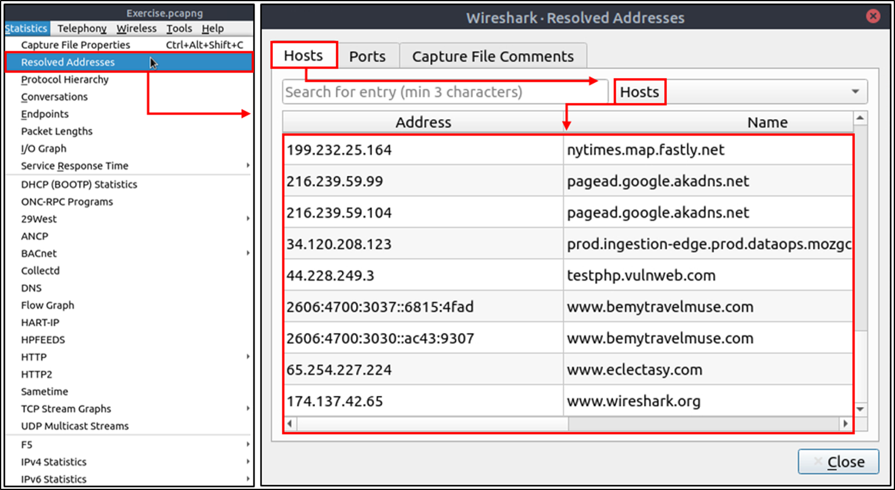
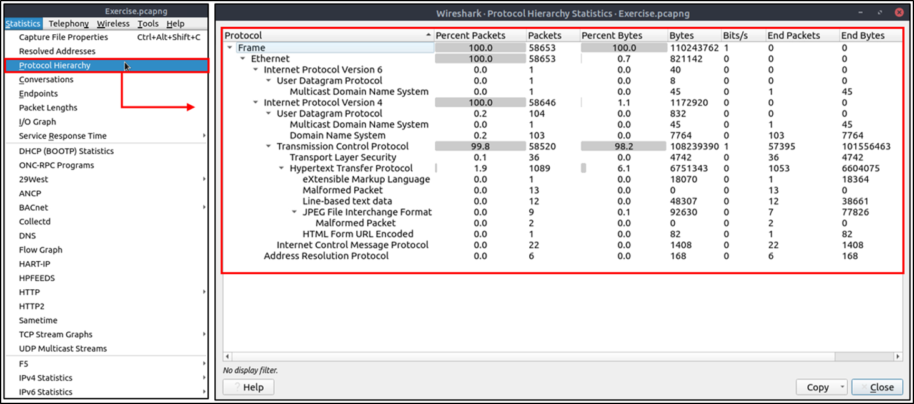
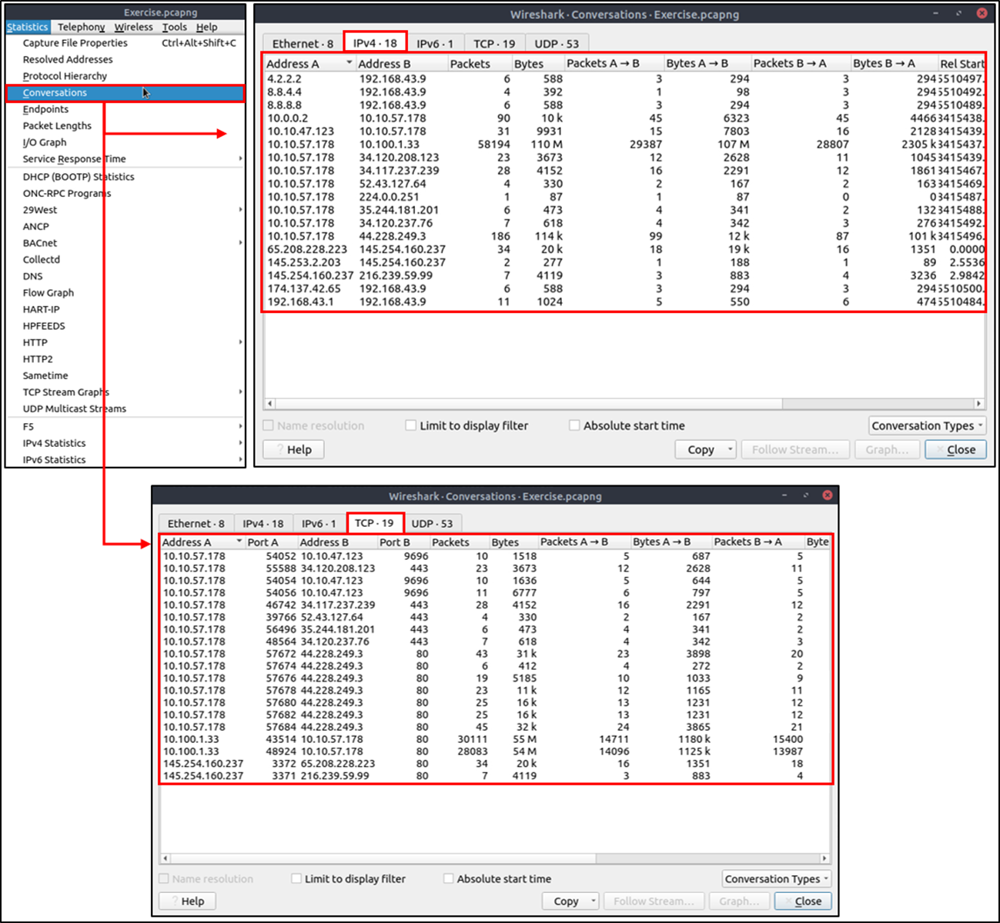
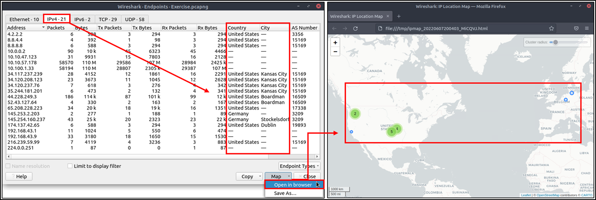

## Day 69
### [**Streak**](https://tryhackme.com/Tushig3531/streak)
---
**Room Completed**
[**Wireshark: Packet Operations**](https://tryhackme.com/room/wiresharkpacketoperations)
---
We use Statistics menu to et the summaries, 

Statistics meny:
- Resolved addresses:
- - What it shows: a list of IP addresses seen in the capture and the hostnames/domains Wireshark can associate with them
- - Important detail: in the text it says the hostname info is taken from DNS answers inside the capture. Which means: If the pcap contains A/AAAA DNS responses like example.com -> 1.2.3.4, Wireshark can “resolve” that. And if the pcap doesn't include DNS answers 
- - Why it matters: quickly spot what resources were accessed (domains), which is often more meaningful than raw IPs.

- Protocol Hierarchy
- - What is this: a tree breakdown of protocols in the capture (Ethernet → IP → TCP/UDP → HTTP/DNS/TLS/etc) with packet counts and percentages.
- - Why it matters: tells us what the traffic mostly is

- Conversation
- - What is this: tells "who talked to who" as pairs: Ethernet, IPv4, IPv6, TCP, UDP
- - Why it matters: this is where we can find: suspicious external IPs, a single host talking to many hosts, large transfers, odd ports.

- Endpoint
- - What is this: a list of unique individual endpoints (think nodes in a graph), again by Ethernet/IP/TCP/UDP categories.
- - Difference vs Conversations: Endpoints: “Which unique devices/hosts/ports exist here, and how much traffic each one did.”, “Which pairs exchanged traffic, and how much per pair.”

- Name Resolution
- - Wireshark can replace numbers with human-friendly labels

- GeoIP mapping (where IPs are located)
- - Wireshark can add geolocation info to IPs using a GeoIP database (they mention MaxMind DB).
- - We have to: download MaxMind DB files,and point Wireshark to them in: Edit → Preferences → Name Resolution → MaxMind database directories
- - Then Wireshark can show country/geo info in IP details, and sometimes a map view.

Basically:
- What protocols are in here? (Protocol Hierarchy)
- What hosts/domains show up? (Resolved Addresses, Endpoints)
- Who’s talking to who the most / weirdest? (Conversations)
- Can I label things to read faster? (Name resolution + GeoIP)

