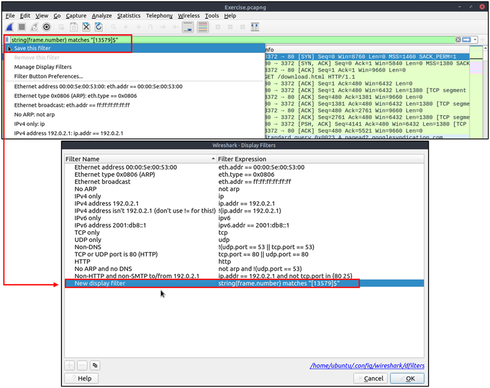
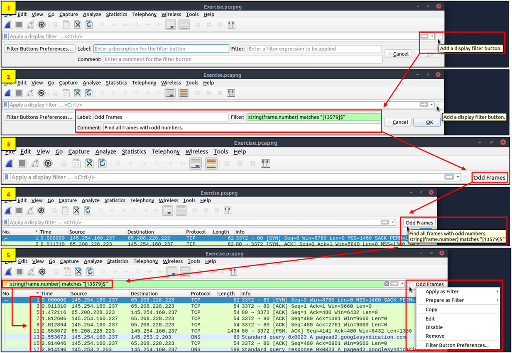

## Day 70
### [**Streak**](https://tryhackme.com/Tushig3531/streak)
---
**Room Completed**
[**Wireshark: Packet Operations**](https://tryhackme.com/room/wiresharkpacketoperations)
---
### Packet Filtering | Principles

Capture Filters : This type of filter is used to save only a specific part of the traffic. It is set before capturing traffic and not changeable during the capture. 

Display Filters : This type of filter is used to investigate packets by reducing the number of visible packets, and it is changeable during the capture. 

We cannot use the display filter expressions for capturing traffic and vice versa.

**Capture Filter Syntax**
Capture filter use byte offset hex values and masks with boolean operations. 
- Scope: host, net, port and portrange.
- Direction: src, dst, src or dst, src and dst,
- Protocol: ether, wlan, ip, ip6, arp, rarp, tcp and udp.
- Sample filter to capture port 80 traffic: tcp port 80

**Display Filter Syntax**
Wireshark has a built-in option (Display Filter Expression) that stores all supported protocol structures to help analysts create display filters.

**Comparison Operators**
| English | C-Like | Description                   | Example                     |
|--------|--------|-------------------------------|-----------------------------|
| eq     | ==     | Equal                         | `ip.src == 10.10.10.100`    |
| ne     | !=     | Not equal                     | `ip.src != 10.10.10.100`    |
| gt     | >      | Greater than                  | `ip.ttl > 250`              |
| lt     | <      | Less than                     | `ip.ttl < 10`               |
| ge     | >=     | Greater than or equal to      | `ip.ttl >= 0xFA`            |
| le     | <=     | Less than or equal to         | `ip.ttl <= 0xA`             |

**Logical Expressions**
| English | C-Like | Description    | Example                                                     |
|--------|--------|----------------|-------------------------------------------------------------|
| and    | &&     | Logical AND    | `(ip.src == 10.10.10.100) AND (ip.src == 10.10.10.111)`      |
| or     | \|\|   | Logical OR     | `(ip.src == 10.10.10.100) OR (ip.src == 10.10.10.111)`       |
| not    | !      | Logical NOT    | `!(ip.src == 10.10.10.222)`                                 |

**Filter color**
Green	Valid filter
Red	Invalid filter
Yellow	Warning filter. This filter works, but it is unreliable, and it is suggested to change it with a valid filter.

**Filters example and description**
IP filters

| Filter                     | Description                                                         |
|----------------------------|---------------------------------------------------------------------|
| `ip`                       | Show all IP packets.                                                |
| `ip.addr == 10.10.10.111`  | Show all packets containing IP address 10.10.10.111.               |
| `ip.addr == 10.10.10.0/24` | Show all packets containing IP addresses from the 10.10.10.0/24 subnet. |
| `ip.src == 10.10.10.111`   | Show all packets originated from 10.10.10.111.                     |
| `ip.dst == 10.10.10.111`   | Show all packets sent to 10.10.10.111.                              |

TCP and UDP Filters

| Filter               | Description                                              |
|----------------------|----------------------------------------------------------|
| `tcp.port == 80`     | Show all TCP packets with port 80.                       |
| `udp.port == 53`     | Show all UDP packets with port 53.                       |
| `tcp.srcport == 1234`| Show all TCP packets originating from port 1234.        |
| `udp.srcport == 1234`| Show all UDP packets originating from port 1234.        |
| `tcp.dstport == 80`  | Show all TCP packets sent to port 80.                    |
| `udp.dstport == 5353`| Show all UDP packets sent to port 5353.                  |

HTTP and DNS

| Filter                         | Description                                   |
|--------------------------------|-----------------------------------------------|
| `http`                         | Show all HTTP packets.                        |
| `dns`                          | Show all DNS packets.                         |
| `http.response.code == 200`    | Show all packets with HTTP response code 200. |
| `dns.flags.response == 0`      | Show all DNS requests.                        |
| `http.request.method == "GET"` | Show all HTTP GET requests.                   |
| `dns.flags.response == 1`      | Show all DNS responses.                       |
| `http.request.method == "POST"`| Show all HTTP POST requests.                  |
| `dns.qry.type == 1`            | Show all DNS "A" records.                     |

What is the number of IP packets? : **ip**
What is the number of packets with a "TTL value less than 10"? : **ip.ttl < 10**
What is the number of packets which uses "TCP port 4444"? : **tcp.port==4444**
What is the number of "HTTP GET" requests sent to port "80"? : **http.request.method == "GET" && tcp.dstport == 80**

### Advanced Filtering
| Filter    | Type                | Description                                     | Example Use Case                         | Usage Example                                  |
|-----------|---------------------|------------------------------------------------------------------|------------------------------------------|------------------------------------------------|
| contains  | Comparison Operator | Checks if a field includes a specific value (case-sensitive).   | Find servers running Apache.             | `http.server contains "Apache"`               |
| matches   | Comparison Operator | Matches a field against a regular expression (case-insensitive).| Find `.php` or `.html` web pages.        | `http.host matches "\.(php|html)"`            |
| in        | Set Membership      | Checks if a value belongs to a defined list or range.            | Find traffic using common web ports.     | `tcp.port in {80 443 8080}`                    |
| upper     | Function            | Converts text to uppercase before comparison.                   | Find APACHE servers regardless of case. | `upper(http.server) contains "APACHE"`        |
| lower     | Function            | Converts text to lowercase before comparison.                   | Find apache servers regardless of case. | `lower(http.server) contains "apache"`        |
| string    | Function            | Converts a non-string field into text for pattern matching.     | Find frames with odd frame numbers.     | `string(frame.number) matches "[13579]$"`     |

contains : simple text search (case-sensitive)
matches : powerful regex search (best for patterns)
in : clean alternative to multiple OR conditions
upper() or lower() : useful for handling inconsistent capitalization
string() : enables regex matching on numeric fields

**Bookmarks and Filtering Buttons**
We can save or bookmart the Wireshark filters so we can reuse them quickly with clicks instead of typing.

Creating Display Filter:

Find all Microsoft IIS servers. What is the number of packets that did not originate from "port 80"?: **http.server contains "Microsoft-IIS" && tcp.srcport != 80**
Find all Microsoft IIS servers. What is the number of packets that have "version 7.5"? **http.server contains "Microsoft-IIS" && http.server contains "7.5"**
What is the total number of packets that use ports 3333, 4444 or 9999? : **tcp.port in {3333 4444 9999} || udp.port in {3333 4444 9999}**
What is the number of packets with "even TTL numbers"? : **string(ip.ttl) matches "(0|2|4|6|8)$"**
Change the profile to "Checksum Control". What is the number of "Bad TCP Checksum" packets? : 