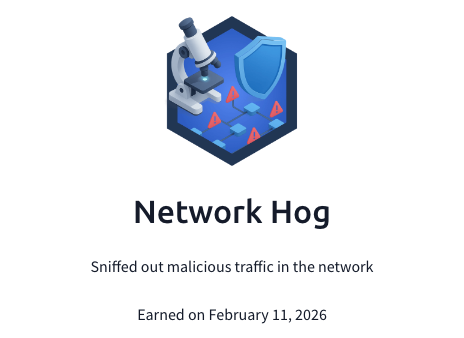

## Day 85
### [**Streak**](https://tryhackme.com/Tushig3531/streak)
---
**Room Completed**
[**Snort**](https://tryhackme.com/room/snort)
---
To learn more deeply, I started writing everything down to get a better understanding.
For today’s learning, I finished my Snort module on top of the Network Security Monitoring module. Throughout the study session, I learned more about Snort’s operations, such as Packet Logger Mode, IDS/IPS mode, and PCAP investigation, along with their parameters and how I can use them more efficiently in real-life scenarios to identify alerts. On top of that, I learned about Snort rule structures, and then I created my own rules through the module questions. Eventually, by the end, I learned exactly how Snort works and which important details I should know to work with it later. The takeaway from this study session was that I worked on Snort and gained significant experience working with this tool.
---
[View my Day 84 notes (PDF)](Snort-Part2.pdf)
