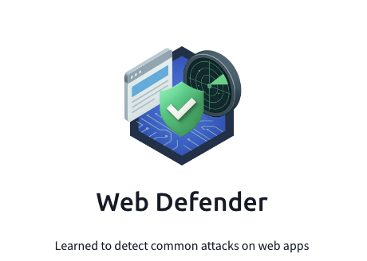

## Day 89
### [**Streak**](https://tryhackme.com/Tushig3531/streak)
---
**Room Completed**
[**Detecting Web DDoS**](https://tryhackme.com/room/detectingwebddos)
---
To learn more deeply, I started writing everything down to get a better understanding.
For today’s learning, I covered DDoS attacks, their purposes, defenses, and detection methods. Even though I had heard a lot about DDoS attacks, I had no clue what they specifically target, their purposes, or how they are detected and defended against. Throughout this room, I covered those concepts and methods to detect attacks using Splunk and Wireshark, and how we can possibly improve defense using CAPTCHA and extended CDN and servers.
---
[View my Day 89 notes (PDF)](Detecting_Web_DDoS.pdf)
