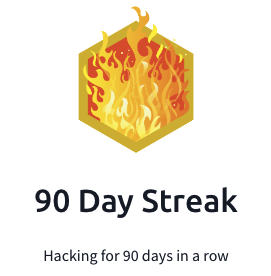

## Day 90
### [**Streak**](https://tryhackme.com/Tushig3531/streak)
---
**Room Completed**
[**Windows Logging for SOC**](https://tryhackme.com/room/windowsloggingforsoc)
---
To learn more deeply, I started writing everything down to get a better understanding.
For today, I covered Windows security log files, and most importantly, Event Viewer really caught my attention. I enjoyed working with Event Viewer—it’s clear, easy to understand, and the verbose details were really helpful. I also reviewed key Windows and Sysmon Event IDs, and learned where to find the PowerShell history file.
---
[View my Day 90 notes (PDF)](Windows-Logging_for_soc.pdf)
