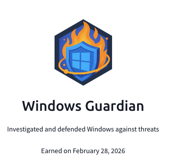

## Day 92
### [**Streak**](https://tryhackme.com/Tushig3531/streak)
---
**Room Completed**
[**Windows Threat Detection 2**](https://tryhackme.com/room/windowsthreatdetection2)
[**Windows Threat Detection 3**](https://tryhackme.com/room/windowsthreatdetection3)

---

To learn more deeply, I started writing everything down to get a better understanding.
Today, I covered Windows threat detection using Windows PowerShell, how attackers perform collection on our systems, and how we can detect C2 and persistence in Windows OS. Most of the topics were covered in previous rooms, but it was interesting working in Event Viewer—especially with Sysmon. Answering the questions by looking for patterns in the event logs was really interesting.

---

[View my Day 92 notes (PDF)](Windows-threat-detection-2-3.pdf)
