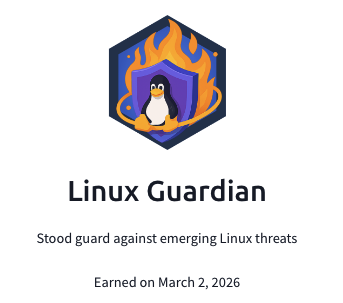

## Day 94
### [**Streak**](https://tryhackme.com/Tushig3531/streak)
---
**Room Completed**
[**Linux Threat Detection 2**](https://tryhackme.com/room/linuxthreatdetection2)
[**Linux Threat Detection 3**](https://tryhackme.com/room/linuxthreatdetection3)
---

To learn more deeply, I started writing everything down to get a better understanding.
Today, I finished the Linux Security Monitoring module. Across these two rooms, I deepened my knowledge of Linux and became more fluent with the OS—especially with commands like grep, ausearch, curl, and others. I also learned more about persistence in Linux, how we can detect it, and how attackers can hide malicious files and repeatedly carry out their activities in the background. One surprising thing I learned is that we can transfer files through SSH; I didn’t know that before. I’m happy that I completed these two rooms.

---

[View my Day 94 notes (PDF)](Linux-threat-detection-2-3.pdf)
