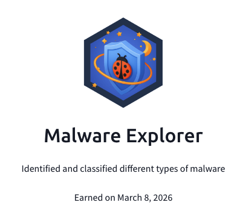

## Day 96
### [**Streak**](https://tryhackme.com/Tushig3531/streak)
---
**Room Completed**
[**Intro to Malware Analysis**](https://tryhackme.com/room/intromalwareanalysis)
[**Living Off the Land Attacks**](https://tryhackme.com/room/livingoffthelandattacks)
[**Shadow Trace**](https://tryhackme.com/room/shadowtrace)
---

To learn more deeply, I started writing everything down to get a better understanding.
Today, I have finished 3 rooms. From the first room, I have learned about static, dynamic, and advanced malware analysis, and Portable Executable (PE). From these subjects, I have learned how to do static analysis without opening the file and by using PE. PE was an incredible tool for static analysis, and using it was so interesting, and I have learned a lot from it. From dynamic and advanced analysis, I have learned how to use a sandbox and what I should keep in mind when I am analyzing malware, and how malware can avoid detection even from a sandbox. From the next room, "Living off the Land Attacks," I have learned how attackers can use system cracks cleverly and deliver malware into the system via PowerShell, WMIC, Certutil, MSHTA, Rundll32, and Scheduled Tasks. While exploring those, I have improved my PowerShell knowledge and understood what those commands and purposes are, and realized how big and complex the computer system is. In the last room, Shadow Trace, I used the knowledge from these 2 rooms and captured the flag. Because I learned the subject really well, capturing the flag was not a problem for me, and it was so exciting to use my knowledge in the lab.

---

[View my Day 96 notes (PDF)](Intro-to-Malware-Analysis_Living-off-the-Land-attack_Shadow-Trace.pdf)

