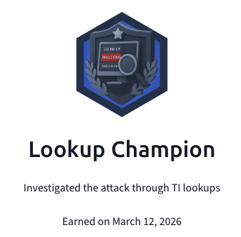

## Day 98
### [**Streak**](https://tryhackme.com/Tushig3531/streak)
---
**Room Completed**
[**IP and Domain Threat Intel**](https://tryhackme.com/room/ipanddomainthreatintel)
[**Invite Only**](https://tryhackme.com/room/invite-only)

---

To learn more deeply, I started writing everything down to get a better understanding.
Today, I learned how to investigate IP addresses and domains, and what information we can find from them. I also learned about open-source and publicly available websites and sources that help us track IPs and domains and understand what information about them is publicly available. By knowing what an IP address or domain is and which party is behind it, we can avoid mistakes and better determine what is legitimate and what is an actual threat.

Among those sources, I really liked online nslookup, which helps us check what an IP address or domain is; Whois; and iplocation.net/ip-lookup, which shows where an IP address is from. RDAP provides official registration details for IP addresses, and ipinfo.io gives us the Autonomous System Number and other useful information. Shodan.io shows which ports are publicly available, crt.sh shows certificates, and Censys.io reveals exposed services even on non-standard ports, which I found amazing. IP2Proxy also tells us whether an IP is using a VPN or proxy.

---

[View my Day 98 notes (PDF)](Ip-and-domain-threat-intel.pdf)

