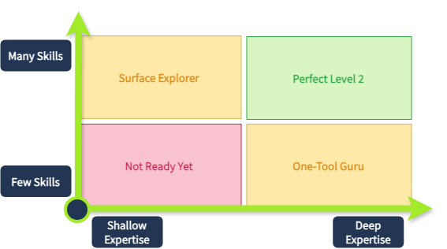
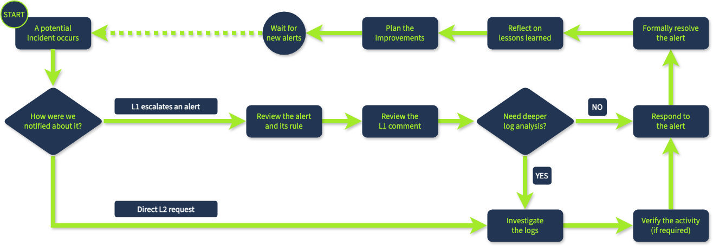
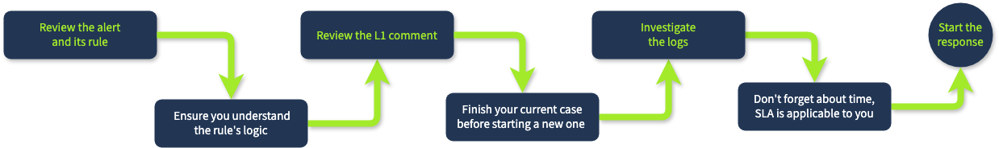
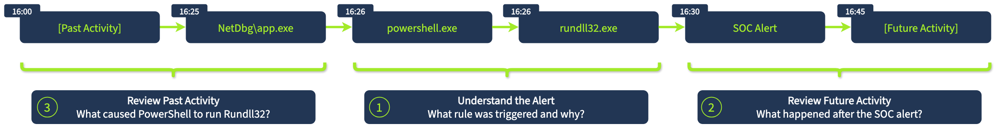
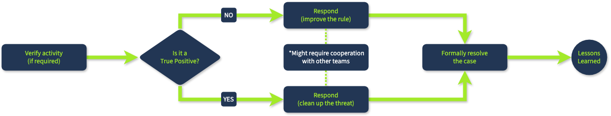

## Day 102
### [**Streak**](https://tryhackme.com/Tushig3531/streak)
---
**Room Completed**
[**Senior Security Analyst Intro**](https://tryhackme.com/room/seniorsecanalystintro)
[**SOC L2 Alert Triage**](https://tryhackme.com/room/socl2alerttriage)
---

## 1. L1 vs L2 — the real difference

Biggest difference between L1 and L2 is not in technical knowledge, instead it is in soft skill: **responsibility, attitude, and mindset**.

**As been SOC L2, I will start doing:**
- Other than just doing the SIEM incident handling, it will start requiring on-side investigations
- Read and observe the attack blogs, and see if it is the same one is happening in my company
- Start creating rules in SIEM
- Simulate the attack and build detection rules
- Automating the manual tasks
- Learn more about the life in company
- Discover new enterprise softwares
- Explore new security domains

---

## 2. SOC L2 Workflow

**For example:** L1 quickly review the alert and escalate it up to 10 minutes, but L2 now investigate that alert for 2 hours, coordinates with other teams and fully mitigate the attack.

### SOC Triage: Level 1 vs Level 2

| Triage Aspect | Level 1 | Level 2 |
|---|---|---|
| **Trigger** | New security alert | Escalated alert |
| **SLA** | Applicable (MTTA/MTTR) | Applicable (same as L1) |
| **Focus** | Quick alert triage within SLA | Deeper log analysis and response |
| **Platform** | Mostly a ticketing system and SIEM | Wider range of SOC and IT tools |
| **Response** | Basic response, such as: • Quarantine malicious download • Approve SOAR alert playbook | Advanced response, such as: • Manually clean up malware • Disable users and isolate hosts |

---

## 3. Log Analysis for L2

1. Start the triage only once I truly understood the detection rule — without knowing what is triggering, can't know what should we investigate
2. Don't work on multiple cases at the same time
3. Try to fit in SLA — if it is taking so long, contain the threat and then investigate

### See and understand what exactly happened in log

While creating a story or investigating, create a proper timeline, and summarize the incident. Make sure I don't miss any hidden indicator, backdoor, or anything crucial. Search them through `EventId`, `ProcessId`, `ParentProcessId`.

> Just like Sherlock Holmes, try to understand everything, if not start over again.

---

## 4. Response

After finishing the investigation, Response part begin:

**Regular false positive**
- Connect to the indicator, and make sure if the person was him
- If he replies "yes" → flag as false positive and close the alert
- If not responding → contain, and let the branch manager know about the containment

**True positive**
- Do containment through EDR: Removing, Isolating, Disabling

**Major incident** — take action as fast as possible
- **Containment:** Stop the threat from spreading
- **Eradication:** Clean up malware files, rotates the stolen credentials, revoking the privilege
- **Recovery:** Patch the vulnerability, monitor for reinfection trace
---

<!--  -->