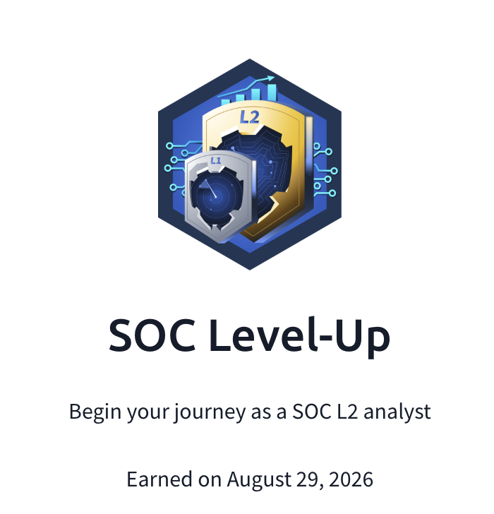

## Day 103
### [**Streak**](https://tryhackme.com/Tushig3531/streak)
---
**Room Completed**
[**Report Writing for SOC L2**](https://tryhackme.com/room/reportwritingsocl2)
[**Defensive Security Trends**](https://tryhackme.com/room/defensivesecuritytrends)

---

## 1. Report Writing for SOC L2

L2 reports must be professional and credible.
In L1, analyst often communicate within a team, but in L2 I need to write a report to other branches professionals.

**Who I write to:**
- **Top Management (C-level):** To present the incident summary or SOC reports
- **External MSSP customers:** To report the detected intrusions and agree on next steps
- **DFIR, CTI, InfoSec teams**

### Communication types

| Type | When to use |
|---|---|
| **Voice call** | Urgent |
| **Email** | Formal notice or update |
| **Ticketing system** | Based on the internal system, but just like an email |
| **Corporate chat** | Informal, internal discussion |

### Reporting to C-level

Whenever SOC team handles or misses an incident, we often need to report to **CTO** (Chief Technology Officer), **CISO** (Chief Information Security Officer), **CEO** (Chief Executive Officer).

In that communication:
- Focus on business — focus on what is important for the company
- Use formal tone
- Keep it simple
- Talk in facts
- Don't panic

### Reporting to customers

On top of that, before and after incident we have to communicate to our customers:
- **Before:** Explaining the incident, whether ask if the customer needs to stop or update the system, and explain the summary of the incident and what they should do
- **After containment:** We should explain the report to our customers and answer the questions

### Using AI in writing

- AI is mostly based on LLM, it might box you in only in feeded data or structure
- If using cloud GenAI, don't ever put confidential data in prompt
- Keep the report structured and actionable, don't put unnecessary details and words
- It helps on writing, not on decision making

---

## 2. Defensive Security Trends

Attacks are getting faster every day, in nowadays and in some cases, it may take only **3-4 hours** from initial access to final damage. So to keep up with it, analyst needs to work and be faster.

| # | Recommendation | Description |
|---|---|---|
| 1 | **Contain first, investigate second** | Use EDR capabilities and SOAR playbooks to contain the threats before a human analyst joins, and then use your log analysis skills to dig deeper, finalize the response, and tune the tools if needed. |
| 2 | **Address detected security gaps** | Always report detected vulnerabilities and misconfigurations to your IT team and control the fixes. The better your network is configured, the longer attacks will take, and the more time you'll have to stop them. |
| 3 | **Automate time-consuming routine** | Think about which part of your triage takes the most time and optimize or automate it. It may be a slow SIEM, a lack of context, or just a ticketing routine. Your goal is to begin a response as soon as possible. |

### Attacks are getting more complex

Therefore, the attackers are becoming even more complex and using anything that could seem harmless to attack.
On top of that, due to cloud services, just logging into cloud service could potentially damage the system.

Therefore, attacker can attack from the inside of the service, by just simple log in and do their malicious activity.

### Infostealers

And, data stealer is even more harmful than it looks, because we lost our data years ago, if the passwords didn't change, ransomware attack through ssh, browser session, access tokens and other method which works without MFA.

Then, the lost datas could be sold in Blackmarket to ransomware groups, but the infostealers could be anywhere from phishing, pirated software, to face CAPTCHAs.

### Supply Chain Attack

> Basically similar to phrase that: "If you want to sabotage a city, poison the running water"

- On these world, we use a lot of open-sources, even though those open sources may seem harmless, it could be the deadliest thing
- It is hard to detect, all of a sudden malicious actions pops from no where

**Tips for SOCs for Supply Chain Attack**

*Detection Tips:*
- Monitor for supply chain threats in cyber news and hunt for traces of infection
- Never discard an alert because it is trusted source
- No matter if the threat comes from a browser or DAEMON Tools, the next attack steps are usually the same. Ensure your SOC has a good MITRE coverage.

*Response Tips:*
- Ensure the least privilege principle; even through get the keys, they shouldn't be able to unlock every door
- Wait 3+ days before updating the dependencies
- Install EDR and implement application control that blocks software not needed for work

---

