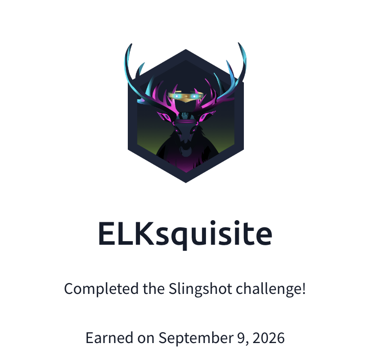

## Day 111
### [**Streak**](https://tryhackme.com/Tushig3531/streak)
---
**Room Completed**
[**Elastic: Using Logstash**](https://tryhackme.com/room/logstash)
[**Slingshot**](https://tryhackme.com/room/slingshot)
---

> Today, I am learning Elastic.

Elastic's Logstash is an open source data processing engine that allows us to collect, enrich, and transform data from different sources.

### Comparison with other shippers

| Elastic Stack Component | Primary Role | Capability | Management | Common Use Case |
|---|---|---|---|---|
| Logstash | Data processing pipeline | Advanced filtering, parsing, and enrichment | Standalone configuration files | Custom pipelines and complex transformations |
| Beats | Lightweight data shippers | Minimal processing | Individual Beat configuration files | Sending logs and metrics from endpoints |
| Elastic Agent | Unified data collection agent | Basic, with Agent integrations | Centrally managed via Fleet Server in Kibana | Modern, centralized Elastic deployments |

### Plugin Architecture

Logstash relies on a modular plugin architecture, which makes it highly flexible. Plugins are organized into three main categories:

- **Input plugins** : Collect data from sources
- **Filter plugins** : Parse, normalize, enrich, and manipulate events as they pass through the pipeline
- **Output plugins** : Send the processed data

Basically: input → filter → output

### Common filter plugins

| Plugin Name | Description |
|---|---|
| Grok | Parses unstructured log data using custom patterns and extracts structured fields from it |
| Mutate | Performs various mutations on event fields, such as renaming, removing, converting data types, and more |
| Date | Parses and manipulates dates and timestamps in event fields. Allows you to extract, format, or convert timestamps to a desired configuration |
| Translate | Translates values in event fields based on defined mappings. Can be used for data normalization or mapping codes to meaningful values |
| Prune | Removes fields from events using a whitelist or blacklist based on field names or field values |

### Common output plugins

| Plugin Name | Description |
|---|---|
| Elasticsearch | Sends events to Elasticsearch for indexing, storing data for further analysis and search |
| File | Writes events to files on the local file system or a network mounted file system. Useful for storing data locally or archiving log files |
| HTTP | Sends events to an external service over HTTP or HTTPS. Useful for integrating Logstash with REST APIs, webhooks, or SOAR platforms |
| STDOUT | Prints events to the console. Useful for debugging or quick data inspection |
| Kafka | Produces messages to an Apache Kafka message broker, enabling Logstash to send data to other systems via Kafka |

### Configuring Input

**File input:**
```bash
input {
  file {
    path => "/path/to/your/file.log"
    start_position => "beginning"
    sincedb_path => "/dev/null"
  }
}
```

**Beat input:**
```bash
input {
  beats {
    port => 5044
  }
}
```

**TCP input:**
```bash
input {
  tcp {
    port => 5000
    codec => json
  }
}
```
`codec` tells Logstash how to interpret incoming data. Common options are `plain` (default) or `json` if sending JSON formatted logs.

**UDP input:**
```bash
input {
  udp {
    port => 514
    codec => "plain"
  }
}
```

**HTTP input:**
```bash
input {
  http {
    port => 8080
  }
}
```

### Filter

**Mutate, add a field:**
```bash
filter {
  mutate {
    add_field => { "new_field" => "new_value" }
  }
}
```
This adds a new field called `new_field` with the value `new_value` to each event.

**Mutate, rename a field:**
```bash
filter {
  mutate {
    rename => { "IPAddress" => "client_ip" }
  }
}
```

**Grok:**
Parses unstructured text logs into structured fields, making them easier to analyze in Kibana.
```bash
filter {
  grok {
    match => { "message" => "%{PATTERN:field_name}" }
  }
}
```
Example using predefined patterns:
```bash
filter {
  grok {
    match => { "message" => "%{IP:client} %{WORD:method} %{URIPATHPARAM:request} %{NUMBER:bytes} %{NUMBER:duration}" }
  }
}
```

**Pruning fields:**
Removes fields from log data based on a whitelist or blacklist of field names.
```bash
filter {
  prune {
    whitelist_names => ["field1", "field2"]
  }
}
```

**Dropping events:**
Removes an event from the pipeline entirely.
```bash
filter {
  if [status] == "error" {
    drop { }
  }
}
```

**Parsing key value pairs:**
Turns text with key value pairs into separate fields. Splits each pair using `&` and separates key from value using `=`.
```bash
filter {
  kv {
    field_split => "&"   # separates each key-value pair
    value_split => "="   # separates key from value
  }
}
```

### Output

**Elasticsearch:**
Sends events to an Elasticsearch cluster or data stream for indexing. `data_stream => true` sends events to a data stream rather than a single static index.
```bash
output {
  elasticsearch {
    hosts => ["hostname:9200"]
    data_stream => true
  }
}
```

**File:**
```bash
output {
  file {
    path => "/path/to/output.txt"
  }
}
```

**Logstash (to another Logstash instance):**
```bash
output {
  logstash {
    host => "destination_host"
    port => 5000
  }
}
```

**TCP:**
```bash
output {
  tcp {
    host => "destination_host"
    port => 5000
  }
}
```

**RabbitMQ:**
Publishes events to a RabbitMQ server. `host` specifies the RabbitMQ server's address, `exchange` and `routing_key` define the exchange and routing key for message routing within RabbitMQ.
```bash
output {
  rabbitmq {
    host => "localhost"
    exchange => "my_exchange"
    routing_key => "my_routing_key"
  }
}
```

**Syslog:**
```bash
output {
  syslog {
    host => "syslog_server"
    port => 514
    protocol => "udp"
  }
}
```

**Stdout:**
Prints events to the console.
```bash
output {
  stdout { }
}
```

---

After this room, I completed the Slingshot room. It was a challenge room, so due to ethical reasons I am not writing the answers.

---

