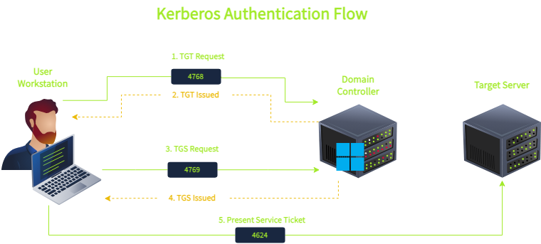
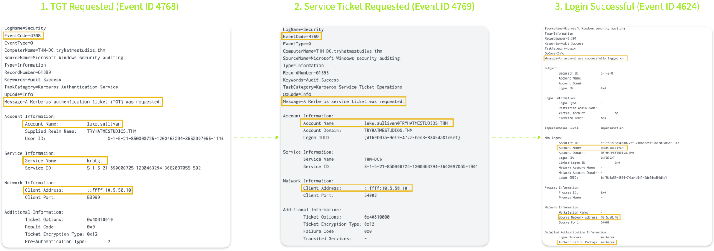
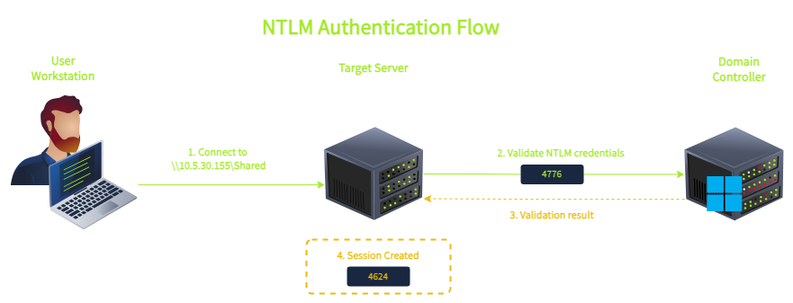
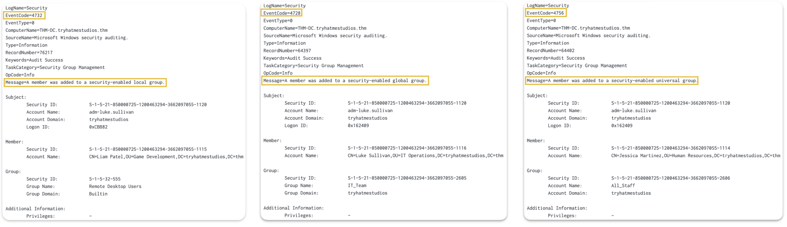
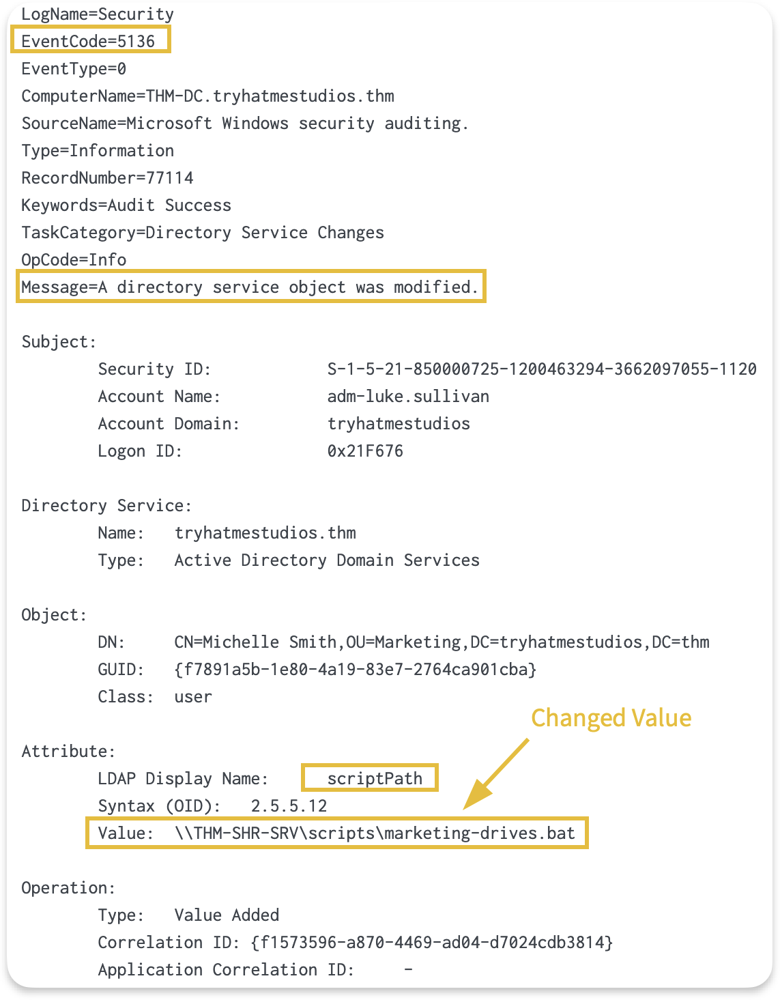

## Day 112
### [**Streak**](https://tryhackme.com/Tushig3531/streak)
---
**Room Completed**
[**Monitoring Active Directory**](https://tryhackme.com/room/monitoringactivedirectory)

---

> Today, I am learning Active Directory.

Active Directory is the identity backbone of most enterprise networks, making it a primary target for attackers.

Active Directory generates thousands of events per hour, including authentication requests, group changes, service tickets, and failed logins. Most of this activity is completely normal.

### Reviewing AD

Managing users, computers, and permissions across a Windows network.

**Core structure:**
- **Domain** : the main container, holds users, computers, groups
- **Domain Controller (DC)** : server running Active Directory, handles logins and policy
- **Forest** : one or more domains sharing a common root
- **OU (Organizational Unit)** : folders for organizing objects and applying policy
- **Group Policy (GPO)** : rules pushed to computers and users (passwords, software, restrictions)

**Authentication:**
- **Kerberos** : the main auth protocol. User gets a ticket from the Domain Controller, then uses it to request access to services
- **NTLM** : older, weaker protocol still used for backward compatibility
- **LDAP (Lightweight Directory Access Protocol)** : the protocol used to query and modify AD objects

> ⚠️ Note to self: the section below was copied from a Claude explanation, not written in my own words yet. Reword before treating this as final notes.

**Kerberos, step by step** (theme park analogy: wristband once = login, then individual ride tickets = service access)

| Step | What Happens |
|---|---|
| 1. Login | Computer sends username + encrypted timestamp to the KDC (usually the DC). Encryption uses a key derived from your password, proving you know it without sending the password itself |
| 2. Get TGT | KDC verifies and issues a TGT (Ticket Granting Ticket) plus a Session Key. TGT is locked with the krbtgt account's password hash, so only the KDC can open it. The Session Key is hidden inside the TGT |
| 3. Request a service | User presents the TGT again, with a new encrypted timestamp (using the Session Key) and the SPN of the service wanted. KDC issues a TGS (Ticket Granting Service) plus a Service Session Key. TGS is locked with the target service's own password hash, so only that service can open it |
| 4. Use the service | User hands the TGS to the service. Service unlocks it with its own hash, checks the Service Session Key matches, and grants access |

Key idea: the password is only used once, at login. Everything after that uses tickets.

**NetNTLM, step by step** (simpler, challenge and response, no tickets)

| Step | What Happens |
|---|---|
| 1 | User requests access from a server |
| 2 | Server sends a random challenge |
| 3 | Client mixes the challenge with the NTLM password hash to build a response |
| 4 | Server forwards the challenge and response to the DC |
| 5 | DC redoes the same math with its stored hash copy, confirms match or mismatch, tells the server |
| 6 | Server passes the result back to the client |

Key idea: the actual password or hash never travels the network, only the response generated from it.

**Key objects:**
- **Users and computers** : every machine and person is an "object" with attributes
- **Groups** : control permissions (Domain Admins, Enterprise Admins are the most sensitive)
- **SPNs (Service Principal Names)** : link services to accounts, relevant to Kerberoasting

### Active Directory Traffic and Logging

| Protocol | Ports | What It Does | Normal Usage |
|---|---|---|---|
| Kerberos | 88 | Default authentication in AD | User logins, service access, ticket requests |
| LDAP | 389, 636, 3268, 3269 | Directory queries and modifications | User lookups, group membership checks, address book queries |
| SMB (Server Message Block) | 445 (139 for legacy NetBIOS sessions) | File sharing, remote administration | Accessing shared folders, printers, administrative tools |
| RDP (Remote Desktop Protocol) | 3389 | Interactive remote desktop | Help desk support, server administration |
| Name Resolution (Legacy) | 137, 138, 5355 | NetBIOS (TCP/UDP 137/138) and LLMNR (5355) | Fallback when DNS fails, for older applications |

### Authentication Events

Whenever a user needs access to a domain resource, they must authenticate. This applies to attackers too. So an authentication event tells us:
- Who
- When
- From where
- Whether they succeeded

**Domain vs Local users**

Not all accounts are domain accounts:
- **Domain Accounts** : authenticated through the Domain Controller, credentials stored in Active Directory. Their events appear on the Domain Controller
- **Local Users** : authenticated through the Security Account Manager (SAM), Domain Controller not involved, events appear only on the specific machine

| User Type | Credentials Stored | Where Authentication Events Appear |
|---|---|---|
| Domain user | NTDS.dit (on DC) | Domain Controller |
| Local user | SAM (on local machine) | Local machine only |

`NTDS.dit` : stores domain user credentials on the domain controller

### Kerberos Authentication

| Step | What Happens | Event ID | Where Logged |
|---|---|---|---|
| 1 | User requests a TGT (Ticket-Granting Ticket) | 4768 | Domain Controller |
| 2 | User requests a TGS (Ticket-Granting Service) | 4769 | Domain Controller |
| 3 | User creates a session on the target | 4624 | Target server |

First the user asks the DC for a TGT using their domain account. After receiving the TGT, the user uses it to ask for a TGS along with which service they want. Once granted, the user accesses the service with the TGS.

If authentication fails, it generates **Event 4771**.

**Encryption Types in 4768/4769 (TGT/TGS)**

Tickets are usually encrypted using:
- RC4 : older systems or applications
- AES-256 : modern systems

| Value | Algorithm | When You See It |
|---|---|---|
| 0x12 | AES-256 | Modern systems, Windows 2008+ domain functional level |
| 0x17 | RC4-HMAC | Legacy systems, older applications, cross-forest trusts |

### NTLM Authentication

| Step | What Happens | Event ID | Where Logged |
|---|---|---|---|
| 1 | The target server asks the DC to validate credentials | 4776 | Domain Controller |
| 2 | Session created on target | 4624 | Target server |

### Accounts, Groups and Resource Access Events

**Account Life Cycle Events**

Every account in AD goes through a lifecycle:
- Account creation
- Password reset
- Occasional lockouts
- Deactivation

| Event ID | What Happened |
|---|---|
| 4720 | Account created |
| 4722 | Account enabled |
| 4724 | Password reset attempted |
| 4725 | Account disabled |
| 4740 | Account locked out |

- `SAM_Account_Name` : field shows the account that was created
- `Subject_Account_Name` : shows which admin account created it

**Group Membership Events**

| Event ID | What Happened | Group Scope |
|---|---|---|
| 4728 | Member added to global security group | Domain-wide |
| 4732 | Member added to local security group | Machine-level (domain local on DCs) |
| 4756 | Member added to universal security group | Entire forest |

**Directory Service Events**

Event 5136 logs attribute-level modifications to Active Directory objects. It shows the specific LDAP attribute that changed and its new value.

**Tracking GPO (Group Policy Object) Modifications**

One important use case for Event 5136 is monitoring changes to Group Policy Objects. GPOs let administrators manage configuration across the domain centrally. A single GPO can deploy software, configure security settings, or change audit policies on thousands of machines at once.

This is exactly why attackers target them. Modifying a single GPO can let an attacker deploy ransomware, disable security controls, or establish persistence across an entire domain in one action.

> Note: Event 5136 captures changes to GPO metadata stored in Active Directory (name, version number, SYSVOL path), but not the actual policy settings inside the GPO. For example, if an admin changes a password policy from 10 to 14 characters, Event 5136 shows the GPO's versionNumber incrementing, but not what specific setting changed. The actual policy configurations live in SYSVOL files, which need separate monitoring.

**Logon Events**

| Event ID | What Happened |
|---|---|
| 4624 | Successful logon |
| 4625 | Failed logon |

`Logon Type` field tells us what kind of activity generated the logon event:

| Logon Type | Meaning | Example |
|---|---|---|
| 2 | Interactive | User at keyboard, physical console |
| 3 | Network | File share access, WMI queries, remote administration |
| 4 | Batch | Scheduled tasks running under a user account |
| 5 | Service | Windows services starting under a service account |
| 7 | Unlock | User unlocking a previously locked workstation |
| 10 | RemoteInteractive | RDP session |

### Understanding Baseline Activity

How do we find unusual activity among thousands of normal events? First we need to know what's normal to be able to detect what's abnormal.

**Common Name Pattern**

When looking at 4769 events, the `Service_Name` field tells us what resource was accessed:

| ServiceName Pattern | What It Represents |
|---|---|
| krbtgt | TGT renewal requests |
| cifs/THM-SHR-SRV | File share access |
| ldap/THM-DC | Directory queries |
| http/THM-WEB-SRV | Web application access |
| MSSQLSvc/THM-SQL-SRV | SQL Server access |
| HOST/THM-IT-DESK | General host services |

---

<!--  -->