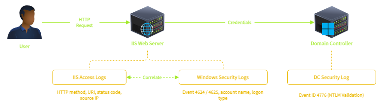
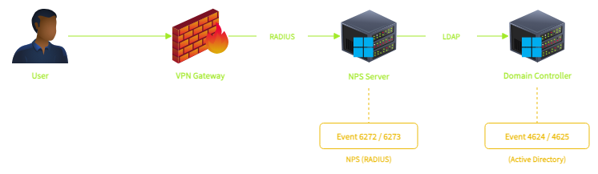

## Day 113
### [**Streak**](https://tryhackme.com/Tushig3531/streak)
---
**Room Completed**
[**Detecting AD Initial Access**](https://tryhackme.com/room/detectingadinitialaccess)

---

> Today, I am learning Active Directory.

### Understanding IIS and Its Logs

Internet Information Services (IIS) is Microsoft's web server platform. Companies use it to host things like Exchange (email), SharePoint (file sharing/collaboration), ADFS (login/authentication), and other internal apps.

When a user logs into an IIS hosted application, IIS passes the credentials to Active Directory for validation. This means IIS authentication generates events in both the IIS access logs and the Windows Security logs on the web server, while the Domain Controller logs Event 4776 for credential validation.

IIS stores access logs in `C:\inetpub\logs\LogFiles\W3SVC1` by default.

| Field | Description | Why It Matters |
|---|---|---|
| c-ip | Client IP address | Identifies the attacker's source IP |
| cs-uri-stem | URI path requested | Reveals what resource was accessed (web shell paths, admin panels) |
| cs-uri-query | Query string | Can contain commands passed to web shells |
| cs-method | HTTP method (GET/POST) | POST requests to unusual paths are suspicious |
| sc-status | HTTP status code | 200 = success, 401 = auth failure, 302 = redirect (used by OWA) |
| cs(User-Agent) | Browser/tool identifier | Can reveal automated tools (curl, Python), though attackers can spoof it |

- **Exchange** : the server that handles email delivery, calendaring, and contacts
- **Outlook** : the desktop client application
- **OWA (Outlook Web Access)** : the browser based version that runs on IIS

### VPN and AD

**VPN authenticates against AD**

In most enterprise environments, the VPN gateway doesn't communicate directly with AD. It uses the RADIUS protocol as an intermediary. On Windows, the RADIUS server is called NPS (Network Policy Server).

NPS events only appear when the VPN gateway is configured to use RADIUS.

**NPS Event IDs**

| Event ID | Meaning | Security Relevance |
|---|---|---|
| 6272 | Network Policy Server granted access | Successful VPN authentication |
| 6273 | Network Policy Server denied access | Failed VPN authentication |
| 6274 | Network Policy Server discarded the request | Malformed or rejected request |

Event 6273 includes a Reason Code field:

| Reason Code | Meaning | What It Tells Us |
|---|---|---|
| 16 | Unknown user name or bad password | Credential attack indicator |
| 48 | No matching network policy | Account not authorized for VPN (not an attack) |
| 65 | RADIUS shared secret mismatch | Misconfiguration (not an attack) |

---

<!--  -->