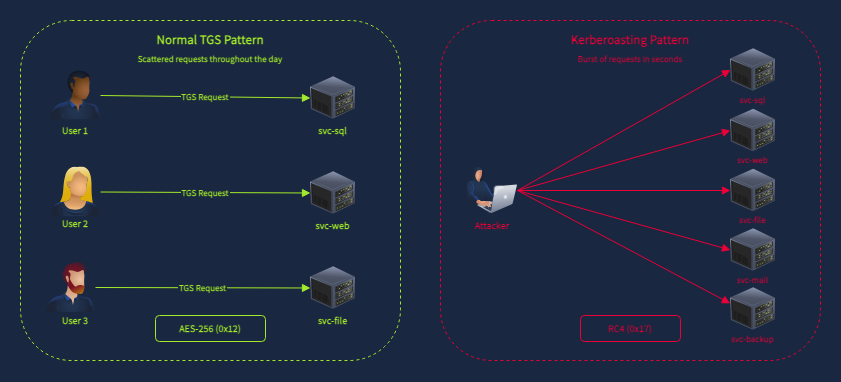
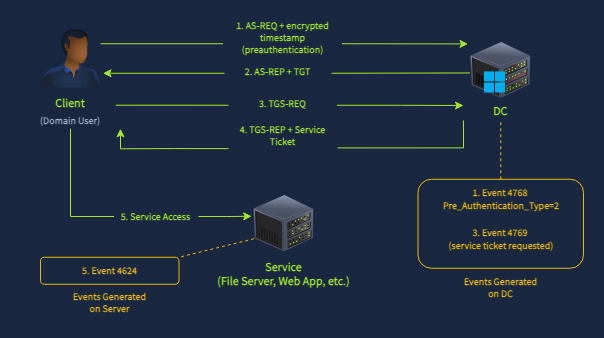
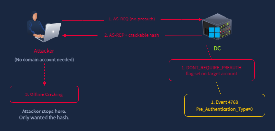
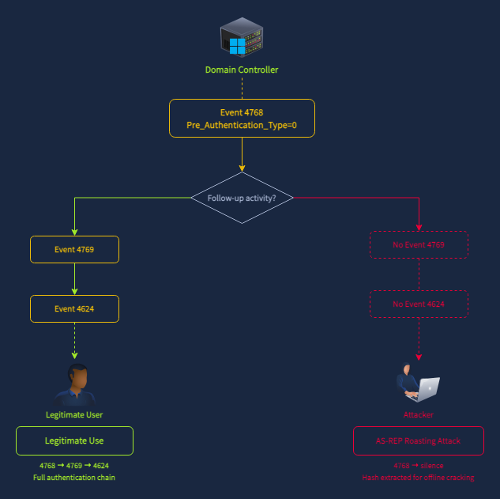
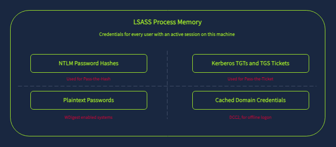
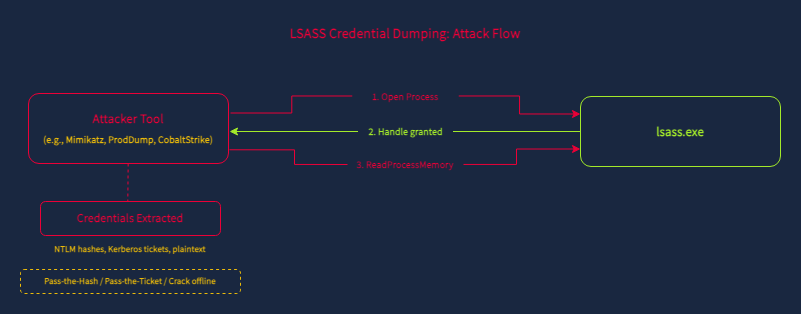
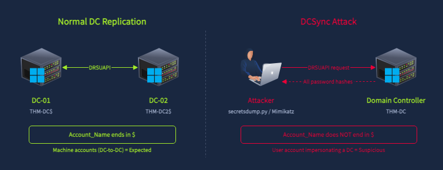
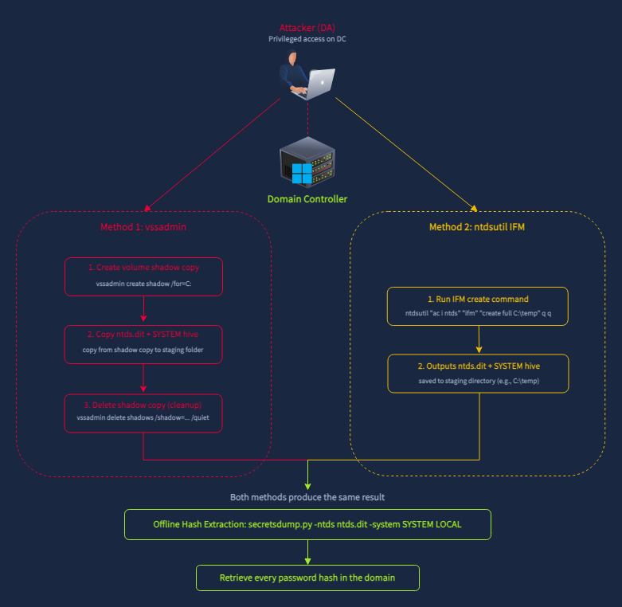
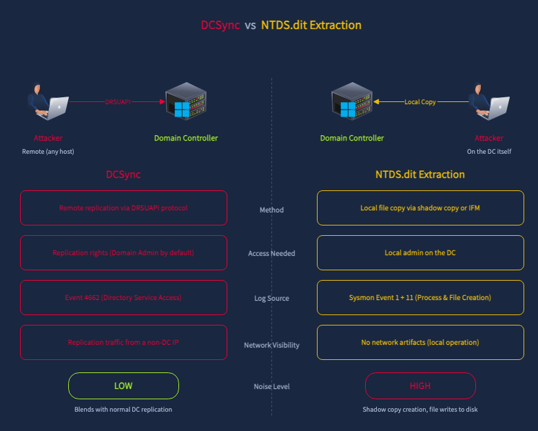

## Day 114
### [**Streak**](https://tryhackme.com/Tushig3531/streak)
---
**Room Completed**
[**Detecting AD Credential Attacks**](https://tryhackme.com/room/detectingadcredentialattacks)
---

> Today, I am learning Active Directory.

**LSASS (Local Security Authority Subsystem Service)** : a core Windows process that handles security related tasks on the system.
- Verifies user logins, checking usernames and passwords when someone signs in
- Enforces security policies
- Manages access tokens
- Handles password changes
- Stores credential material in memory temporarily while a user is logged in

It always runs in the background on a Windows machine.

### Detecting Kerberoasting

Kerberoasting basically starts because of weak passwords. The Domain Controller doesn't check whether the user actually intends to use the service, and on top of that, anyone in the domain can request a service ticket for any SPN in the domain. The attacker takes the ticket and cracks the encryption offline.

Attackers use Kerberoasting tools to downgrade the encryption of the TGS request from AES-256 to RC4, which makes it much faster to crack.

We detect Kerberoasting by how many SPNs or TGTs a user is requesting in a short period of time, based on abnormal behavior.

### Detecting AS-REP Roasting

AS-REP Roasting targets a different weakness entirely: user accounts with preauthentication disabled. It doesn't require SPNs, and unlike Kerberoasting, the attacker doesn't even need valid domain credentials to perform it.

The background is similar to Kerberoasting, the DC hands back encrypted material that the attacker can crack offline to recover the plaintext password. The difference is what triggers the DC to hand it over, and what it's encrypted with.

- **AS-REQ** : Authentication Service Request
- **AS-REP** : Authentication Service Response

In AS-REP Roasting: if an account has `DONT_REQUIRE_PREAUTH` enabled, the DC grants a TGT without confirming the requester knows the password. The attacker can then crack the hash offline. The attacker just needs to know the username of an account with preauthentication disabled.

- `Pre_Authentication_Type=2` : requires password
- `Pre_Authentication_Type=0` : doesn't require password

The key difference between AS-REP Roasting and the normal flow: the attacker requests the TGT purely to extract the crackable hash. They never request a service ticket, and never log onto anything. So the DC logs Event 4768 with `Pre_Authentication_Type=0`, but there is **no 4769 and no 4624**.

### Detecting LSASS Credential Dumping

If a Domain Admin logged into a machine earlier, their credentials are sitting in LSASS memory. The attacker doesn't need to crack anything, they just steal it directly.

LSASS holds different types of credentials depending on Windows version and configuration:
- NTLM password hashes for all authenticated users
- Kerberos tickets (TGTs and TGS tickets) for active sessions
- Plaintext passwords on systems where WDigest is enabled (Windows 8/Server 2012 and earlier by default, or any newer version where the `UseLogonCredential` registry value has been set to 1)
- Cached domain credentials for offline logon

**Detection tool: Sysmon Event 10**

Sysmon is a monitoring tool that logs detailed system activity. Event ID 10 logs "ProcessAccess," meaning it fires whenever one process opens a handle to another process. So if a tool tries to reach into `lsass.exe`, Sysmon can catch that attempt and record details about it.

> This only works if Sysmon is specifically configured to watch `lsass.exe`.

Fields used for detection:

| Field | What It Contains | Why It Matters |
|---|---|---|
| SourceImage | Full path of the process accessing LSASS | Identifies the tool used for the dump |
| SourceUser | The user account running the source process | Identifies the compromised account. SYSTEM is expected; a domain user account is suspicious |
| TargetImage | Full path of the target process (lsass.exe) | Confirms LSASS was the target |
| GrantedAccess | Hex access mask showing requested permissions | Different tools request different access levels |
| CallTrace | DLL call stack leading to the access | Reveals the method used (MiniDump API, injection, etc.) |

**Understanding the GrantedAccess Field**

Windows access permissions get combined into a single hex value. Each permission has its own hex number, and they get added together:

| Access Right | Hex Value | Purpose |
|---|---|---|
| PROCESS_QUERY_LIMITED_INFORMATION | 0x1000 | Query basic process info |
| PROCESS_QUERY_INFORMATION | 0x0400 | Query detailed process info |
| PROCESS_VM_READ | 0x0010 | Read process memory |
| PROCESS_ALL_ACCESS | 0x1FFFFF | Full access to the process |

So `0x1010` means `0x1000 + 0x0010`, meaning the tool asked for basic info plus memory read access. That `0x0010` bit is the critical one for credential theft, since reading memory is literally how the credentials get pulled out.

### Detecting DCSync

Instead of breaking into the DC, the attacker's machine pretends to be a Domain Controller and asks a real DC for password data using the same official method DCs use to talk to each other, called DRSUAPI. It's a legitimate protocol, just used for an illegitimate purpose.

This only works if the attacker's compromised account already has replication permissions, meaning the DC will only hand over that data if it thinks it's talking to something authorized to receive it.

Active Directory has special permission codes (GUIDs, long ID numbers) that control who's allowed to ask for replication data. Three matter here, but only one is really important for DCSync:

- `{1131f6ad-9c07-11d1-f79f-00c04fc2dcd2}` : DS-Replication-Get-Changes-All
- `{1131f6aa-9c07-11d1-f79f-00c04fc2dcd2}` : DS-Replication-Get-Changes
- `{89e95b76-444d-4c62-991a-0facbeda640c}` : DS-Replication-Get-Changes-In-Filtered-Set

The one that matters most is **1131f6ad**, DS-Replication-Get-Changes-All. This is the permission that allows pulling password data, and it's the primary indicator of DCSync.

**Detection with Event 4662**

| Field | What It Contains | Why It Matters |
|---|---|---|
| user | The account performing the replication | Identifies who is running DCSync |
| Access_Mask | 0x100 (Control Access) | Indicates an extended right was exercised |
| Properties | Shows "Control Access" (GUIDs in raw event) | The replication GUIDs confirm DCSync |
| Logon_ID | Hex session identifier | Links to 4624 logon event for source IP correlation |

### Detecting NTDS.dit Extraction

The **NTDS.dit** file is the Active Directory database stored on every domain controller (typically at `C:\Windows\NTDS\ntds.dit`). It contains password hashes for every account in the domain. The problem for attackers: Windows locks this file while AD DS is running, so it can't be copied directly.

Attackers use two main workarounds:

**Volume Shadow Copy (vssadmin):**
- Use the built in Windows tool `vssadmin` to create a Volume Shadow Copy, basically an instant snapshot of the entire disk at that moment, like a frozen photocopy of the whole drive
- Since it's a snapshot and not the live file, it isn't locked, so files can be freely copied out of it
- They copy two things out: the `ntds.dit` file itself (the password database), and the SYSTEM registry hive, which holds the encryption key needed to decrypt those hashes, since `ntds.dit` alone is encrypted and useless without it
- Once they have both files, they delete the shadow copy to try to cover their tracks

**Install From Media / ntdsutil:**
- `ntdsutil` is a real Windows tool made for setting up new Domain Controllers. It has a feature called IFM (Install From Media) that packages a copy of the password database (`ntds.dit`) and the key needed to unlock it (SYSTEM hive), normally so a new DC can be set up faster

- `vssadmin` needs local admin rights
- `ntdsutil` requires Domain Admin or equivalent AD DS permissions

Both produce the same result: an offline copy of the AD database that can be parsed with tools like `secretsdump.py` or `NTDSDumpEx` to extract all password hashes.

**Detecting NTDS.dit Extraction**

NTDS.dit extraction is detected through process creation events. We're looking for `vssadmin.exe` or `ntdsutil.exe` being executed on a domain controller, with command line arguments related to shadow copies or IFM.

### Takeaway

| Technique | Event ID | Detection Signal | Log Source | Privilege Required |
|---|---|---|---|---|
| Kerberoasting | Security 4769 | Ticket_Encryption_Type=0x17, multiple SPNs from one account | DC Security Log | Any domain user |
| AS-REP Roasting | Security 4768 | Pre_Authentication_Type=0, no follow-up authentication | DC Security Log | None (just a username) |
| LSASS Dumping | Sysmon 10 | TargetImage=lsass.exe, suspicious GrantedAccess and CallTrace | Endpoint Sysmon | Local admin |
| DCSync | Security 4662 | Access_Mask=0x100, replication GUIDs, non-machine account | DC Security Log | Domain Admin (replication rights) |
| NTDS.dit Extraction | Sysmon 1, 11 | ntdsutil.exe or vssadmin.exe with IFM/shadow copy arguments | DC Sysmon | Local admin on DC |

---

<!--  -->