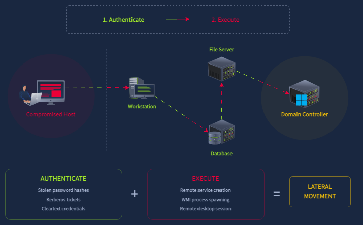
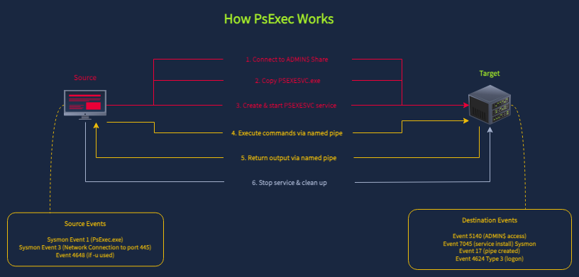

## Day 115
### [**Streak**](https://tryhackme.com/Tushig3531/streak)
---
**Room Completed**
[**Detecting AD Lateral Movement**](https://tryhackme.com/room/detectingadlateralmovement)
---

> Today, I am learning Active Directory.

### Discovery and Reconnaissance

Active Directory discovery commands commonly used in real world attacks.

| Category | Command | What It Reveals |
|---|---|---|
| Domain/Trust | `nltest /dclist:domain` | Domain controllers in the environment |
| Domain/Trust | `nltest /domain_trusts` | Trusted domains the attacker could pivot to |
| Accounts/Groups | `net user /domain` | All domain user accounts |
| Accounts/Groups | `net group "Domain Admins" /domain` | Members of the Domain Admins group |
| Accounts/Groups | `net group "Enterprise Admins" /domain` | Members of the Enterprise Admins group |
| Accounts/Groups | `net localgroup administrators` | Local admin accounts on the current machine |
| Systems | `net view` | Machines visible on the network |
| Systems | `net view \\THM-SHR-SRV /all` | Shares on a specific remote system |
| PowerShell | `Get-ADUser -Filter *` | AD user enumeration via PowerShell |
| PowerShell | `Get-ADGroupMember "Domain Admins"` | Admin group members via PowerShell |
| PowerShell | `Get-ADComputer -Filter *` | All computer accounts in the domain |

None of these commands require admin privileges. Active Directory grants read access to all authenticated domain users by default.

We detect these commands through two log sources:
- **Sysmon Event 1** captures process creation, where CMD/PowerShell commands appear in the command line
- **PowerShell Event 4104** captures Script Block Logging, which records the PowerShell commands and cmdlets executed

**Sample Splunk Queries:**
```bash
index=win EventCode=1
| search CommandLine IN ("*nltest*", "*net * user*", "*net * group*", "*net * view*", "*net * localgroup*")
| table _time, host, User, Image, CommandLine, ParentImage
| sort _time
```
```bash
index=win EventCode=4104
| search Message IN ("*Get-ADUser*", "*Get-ADGroupMember*", "*Get-ADComputer*")
| table _time, Message
| sort _time
```

**Script Block Logging**

Script Block Logging records the actual PowerShell code that runs on a machine, not just the fact that PowerShell was opened.

This matters because attackers love PowerShell, since it's built into Windows and can run entirely in memory without leaving a file behind. They also often disguise their commands (encoding, obfuscation) to dodge basic detection. Script Block Logging catches the real, decoded version of the script anyway, since PowerShell has to unscramble it before running it, and that's the moment logging captures it.

It writes this to Windows logs (Event ID 4104), giving defenders a readable record of exactly what commands ran, even ones an attacker tried to hide.

Like a few other things in this module, it's not on by default. Someone has to turn it on through Group Policy first, or attackers using PowerShell will leave basically no trace.

### How Lateral Movement Works

Every lateral movement technique follows the same basic pattern: the attacker authenticates to a remote machine using stolen or misused credentials, then executes something on it. The technique might differ, but that authenticate-then-execute sequence is always there.



Every remote connection creates artifacts on two machines:
- **Source** : where the attacker initiates the connection. Only shows which credentials were used and which target was chosen
- **Destination** : where the session lands and the action happens. Shows that someone connected and what they did

> If we only check the destination, we know the attack happened, but might not know where it originated. If we only check the source, we know the intent but not whether it succeeded.

**Logon Type**

When someone connects to a remote machine, Windows logs **Event 4624** on the destination. The `Logon_Type` field tells us how they connected.

| Logon Type | Meaning | Common Protocol | What It Tells Us |
|---|---|---|---|
| 3 | Network logon | SMB, PsExec | Remote access without an interactive session |
| 7 | Unlock/Reconnect | RDP | Session reconnect or workstation unlock |
| 10 | RemoteInteractive | RDP | Full desktop session |

**Why Lateral Movement Succeeds**

Lateral movement mainly works because of common misconfigurations:
- Password reuse across local admin accounts means a compromised credential can unlock many machines (Microsoft LAPS is designed to prevent this)
- Shared administrative accounts
- Overly permissive group memberships
- Bad network segmentation between hosts
- Leaving RDP enabled on machines that don't need it widens the attack surface

### Detecting SMB Lateral Movement

Server Message Block (SMB) is a communication protocol. Every time someone maps a network drive, opens a shared document, or prints to a network printer, SMB is involved. Group Policy updates and backup agents generate constant SMB traffic. There's a lot of legitimate SMB activity on any network, which is exactly why attackers like using it.

**Admin Shares**

Windows systems maintain default Administrative Shares (`C$`, `ADMIN$`, `IPC$`) created by the Server service at boot. These shares leverage the SMB protocol (port 445) to allow remote management:
- **C$** : Maps to the root of the system drive; additional drives follow the same pattern (D$, E$, etc.)
- **ADMIN$** : Points to `%SystemRoot%` (typically `C:\Windows`)
- **IPC$** : A logical share for Inter-Process Communication via named pipes, essential for remote RPC calls

Accessing these shares usually triggers two events: **Event 5140** (a network share object was accessed) and **Event 4624** (an account was successfully logged on).

Regular users don't access these during normal work, they use named shares like Marketing, Shared, or IT. When we see admin share access, it's either an administrator doing maintenance or an attacker moving laterally.

**Example Splunk Query:**
```bash
index=win EventCode=5140 Share_Name IN ("*\\ADMIN$\*", "*\\C$\*")
| table _time, host, Source_Address, user, Share_Name
| sort _time
```

Event 5140 gives us everything we need in a single event:
- `host` shows which server was targeted
- `Source_Address` shows where the connection came from
- `user` shows which credentials were used
- `Share_Name` shows which admin share was accessed

### Detecting PsExec Lateral Movement

**How PsExec Works:**

When an attacker already has an authenticated SMB session (via `net use`) and runs `PsExec.exe \\target cmd.exe`, the following happens:
1. PsExec connects to the target's `ADMIN$` share over SMB
2. It copies a service binary (`PSEXESVC.exe`) to the target's `C:\Windows` directory
3. It creates and starts a new Windows service on the target (System Event 7045)
4. The service creates named pipes for stdin/stdout/stderr communication (Sysmon Event 17)
5. That service executes whatever command the attacker specified
6. When the session ends, PsExec removes the service and cleans up the binary



**Example Splunk Query:**
```bash
index=win EventCode=7045
| table _time, host, Service_Name, Service_File_Name, Service_Type, Service_Start_Type, Service_Account
| sort _time
```

**Example to see what command the attacker ran:**
```bash
index=win EventCode=1 host={DESTINATION_HOST} ParentImage="*PSEXESVC*"
| table _time, host, User, ParentImage, Image, CommandLine
| sort _time
```

### Detecting RDP Lateral Movement

RDP's primary detection artifact is **Event 4624 with Logon_Type=10** (RemoteInteractive), logged on the destination. It records the account name, the source IP address, and the session timestamp. While SMB and PsExec both produce Type 3 network logons, a successful RDP session produces Type 10, making it immediately distinguishable in the Security log.

**Normal vs Suspicious RDP Traffic**

| Pattern | Typical? | Why |
|---|---|---|
| Workstation → Server | Yes | IT admins RDP from their workstations to manage servers. This is the standard pattern |
| Workstation → Workstation | Rare | Regular users don't RDP into each other's machines. Helpdesk might, but only from designated IT workstations |
| Server → Server | Suspicious | Servers don't initiate outbound RDP on their own. If a server is RDPing to another server, someone is sitting inside an active session on that server and pivoting outward |


---

<!--  -->