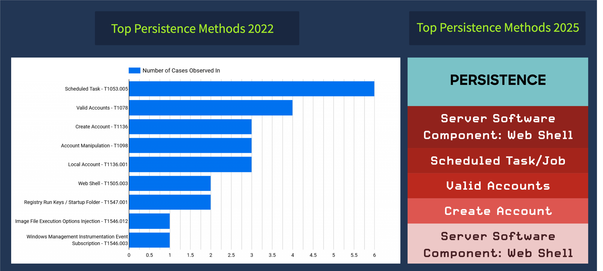
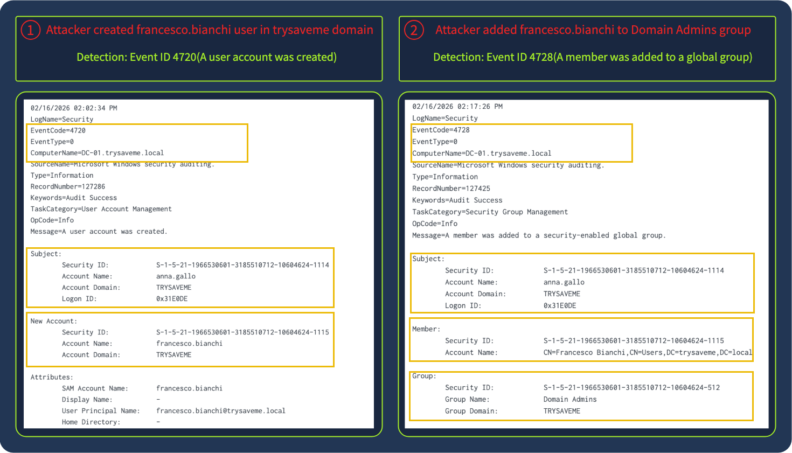
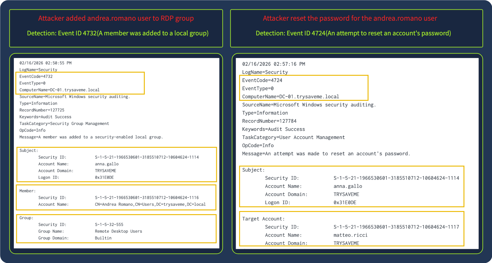
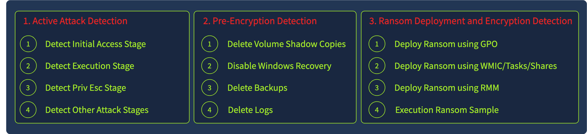
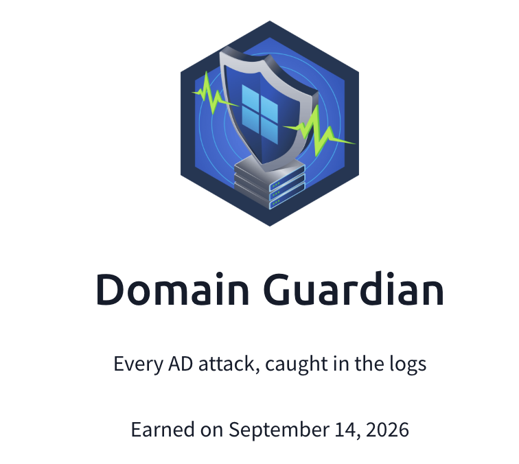

## Day 116
### [**Streak**](https://tryhackme.com/Tushig3531/streak)
---
**Room Completed**
[**Detecting AD Post-Exploitation**](https://tryhackme.com/room/detectingadpostexploitation)
[**New Hire Old Artifacts**](https://tryhackme.com/room/newhireoldartifacts)
---

> Today I learned more about what happens after exploitation: how attackers gain persistence, what stages are involved in ransomware and how we can detect them, and how they carry out data destruction, along with the different types.

### Persistence

This diagram shows the top methods of persistence. Attackers maintain persistence by creating a new privileged user, or by using a valid existing account.

### Ransomware

**Pre-stage detection:**

- **Delete Volume Shadow Copies** : Organizations often use Volume Shadow Copy Service (VSS) for data backup. Threat actors typically delete these shadow copies and disable the service to prevent recovery
- **Disable Windows Recovery** : When a system can't boot normally due to crashes, corrupted files, or boot errors, which often happens during ransomware attacks, users rely on the Windows Recovery mechanism. Attackers frequently disable this before deploying ransomware
- **Delete Backups** : Threat actors systematically identify and destroy backup repositories prior to encryption, to maximize leverage over victims
- **Delete Logs** : Threat actors delete logs to hinder the SOC team's investigation, increasing the time needed to understand how the incident occurred, identify the entry point, and reconstruct the attack timeline

**Ransomware deployment and encryption detection:**

- **Detection via GPO** : Group Policy Objects are convenient for attackers to spread ransomware, since a single GPO can target hundreds or thousands of endpoints in an Organizational Unit at once. The key requirement is that the attacker has the right permissions, such as Domain Admin or Enterprise Admin
- **Detecting WMIC-related activity** : Adversaries frequently leverage WMIC for discovery, persistence, lateral movement, and executing ransomware across the environment. Using the `process call create` command with the `wmic` process lets threat actors remotely execute processes on target systems, including spawning a ransomware executable to trigger encryption. Note: the parent process on the remote system will be `wmiprvse.exe`
- **Detecting schtasks-related activity** : Attackers use `schtasks` to distribute ransomware across the network by creating scheduled tasks that execute the ransomware at the same time on all network hosts
- **Detecting RMM-related activity** : Attackers can gain direct access to the RMM product's management console and distribute/execute ransomware from there, instead of taking the longer path of compromising the AD domain

### Data Destruction

- **Boot-Level Destruction** : Attackers overwrite the Master Boot Record or boot sectors to prevent the system from starting. This targets the first sectors of the disk where boot instructions live, rendering the machine unbootable even though data may still physically exist on the drive
- **File System-Level Destruction** : Attackers corrupt or delete file system metadata structures such as partition tables, Master File Tables, or inode tables. This makes it impossible for the OS to locate or access files, even though the actual data content remains physically intact
- **File Overwriting** : Attackers systematically traverse directories and overwrite file contents with random data or zeros, making recovery impossible. Unlike encryption, this permanently destroys the actual data, not just the keys to access it, so files can't be restored through any forensic method
- **Firmware-Level Destruction** : Attackers target firmware on network devices or storage controllers to render hardware unusable. This low level attack corrupts firmware below the OS layer, often requiring hardware replacement or specialized re-flashing procedures beyond standard system recovery

---

After AD Post-Exploitation, I completed a challenge room. For ethical reasons I am not publishing my answers in this documentation.

---

