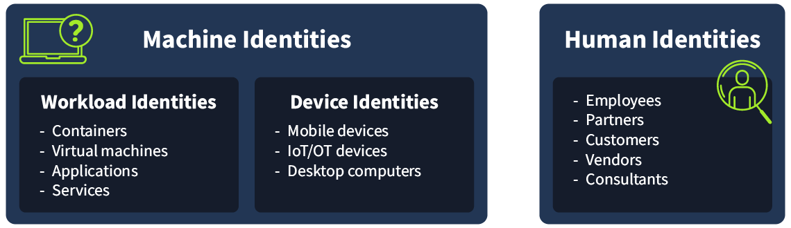
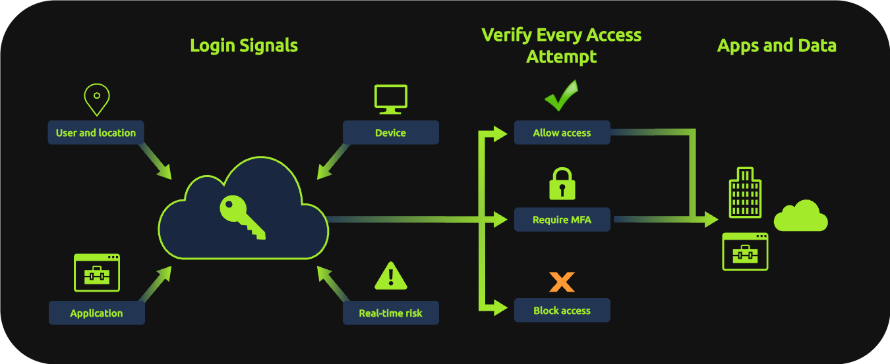
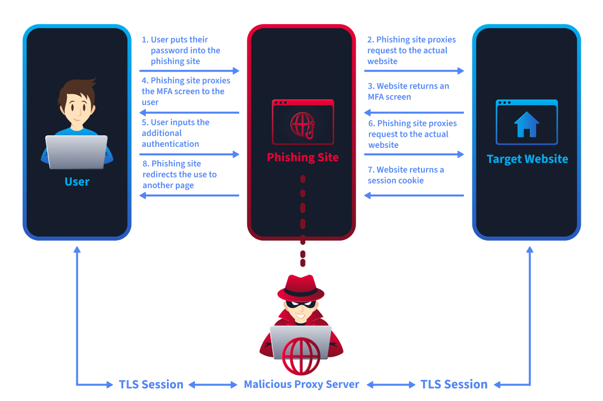
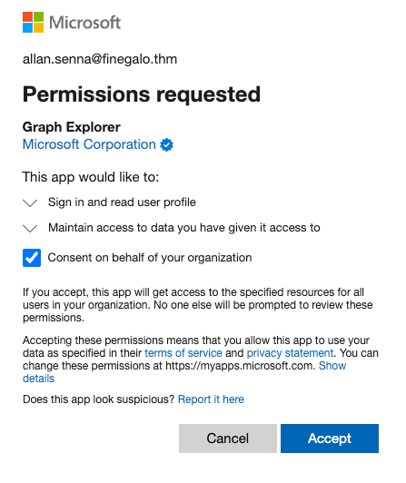

## Day 117
### [**Streak**](https://tryhackme.com/Tushig3531/streak)
---
**Room Completed**
[**M365 Monitoring Basics**](https://tryhackme.com/room/m365monitoringbasics)
[**Entra ID Monitoring**](https://tryhackme.com/room/entraidmonitoring)

---

> Today, I am learning Microsoft Entra ID.

## M365 Monitoring Basics

### What are Identity Providers

Back then, every single system (email server, HR system, project tool, file sharing) managed its own logins separately. Each one was basically its own little island with its own username/password setup. The big problem was that security depended entirely on whether that specific platform happened to support good security features.

Once companies started using lots of SaaS (cloud based) tools and more people started working remotely, this patchwork approach became unmanageable and genuinely insecure.

The fix: platforms like Microsoft Entra ID (formerly Azure AD) act as one central identity provider. Instead of each app handling its own logins, they all plug into this one system. That means:
- Authentication (proving who you are, like logging in) happens in one place
- Authorization (what you're allowed to access) is also controlled from that one place

**Digital Identity**

A digital identity is a set of details that represent "who" or "what" is interacting with a system. It's not just about people, it's about anything that needs to prove who it is to get access to something.

- **Human identities** : represent people, such as employees, contractors, partners, or customers
- **Workload identities** : represent software components, including applications, services, scripts, or containers, that need to authenticate to other systems
- **Device identities** : represent physical devices like desktops, laptops, mobile phones, and IoT devices. Separate from the humans who use them



**Identity Provider (IdP)** is the system responsible for creating and managing these identities. It handles authentication (verifying identity), authorization (controlling access), and auditing by recording identity related activity across connected services.

Example: we can use our Google account credentials to log in to Spotify. Here, Google Sign-In is the IdP, and Spotify is the service provider (SP).

**Benefits of an IdP:**
- **Centralized authentication and management** : all user sign-ins are handled in a single location, making it easier to manage access and investigate suspicious activity
- **Single Sign-On (SSO)** : one successful authentication grants access to multiple cloud services, improving usability while reducing password sprawl
- **Stronger authentication** : features like MFA and Conditional Access can be enforced uniformly across users and applications, instead of configured per system
- **Better visibility and logging** : every authentication attempt generates rich identity logs, giving analysts the context needed to detect and investigate threats

### Identities as the Target

In a cloud-first organization, Entra ID is the gateway to everything.
- It authenticates users and authorizes access to services like Outlook, Teams, SharePoint, and internal applications
- A single privileged compromised account can cause significant damage

**Why Attackers Target Cloud Credentials**
- Remote access from anywhere
- Legitimate access to multiple services via SSO : one successful sign-in can unlock emails, files, chat, and connected apps for a user
- Out of the radar of traditional tools : firewalls and endpoint tools may see nothing suspicious because the attacker is using valid credentials, or the authentication happens outside their visibility
- Direct access to high value resources

**Cloud Identity Provider Security Gaps**

The diagram below illustrates how Entra ID evaluates authentication signals to decide whether to allow, block, or request MFA validation before a user can access the organization's apps and data.



Attackers don't need advanced exploits, they just need a gap. They exploit the lack of these security configurations:
- Lack of multi-factor authentication (MFA) enforcement
- Overly permissive access policies
- Excessive administrative privileges
- Weak password policies
- Disabled authentication risk policies
- Insufficient logging and monitoring

### Entra ID Sign-in Logs

Microsoft Entra ID generates detailed logs for every authentication attempt, configuration change, and administrative action within a tenant. These logs don't just tell you what happened, they tell you who did it, when, where from, and often why it succeeded or failed.

**List all failed sign-ins:**
```bash
index=scenario sourcetype="azure:aad:signin" status.errorCode!=0
| stats count as event_count values(ipAddress) as ip_addresses
values(appDisplayName) as application_name values(status.errorCode) as errorCodes by userPrincipalName
| sort - event_count
| table application_name, userPrincipalName, ip_addresses, errorCodes, event_count
```

**Common Error Codes:**
- 50126 : Invalid username or password
- 50053 : Account locked due to too many failed attempts
- 50074 : MFA required but not provided
- 50055 : Password expired

**List all successful sign-ins from an IP address:**
```bash
index=scenario sourcetype="azure:aad:signin" status.errorCode=0 ipAddress="2804:2488:7082:a4c0:fd97:b11b:9895:49c0"
| stats values(ipAddress) as ip_addresses values(appDisplayName) as applications by userPrincipalName
| table applications, userPrincipalName, ip_addresses
```

### Entra ID Audit Logs

- `activityDisplayName` : the detailed activity or action performed by a user or app
- `initiatedBy` : the account or app that performed the action. When the source is a user account, this field contains its email address
- `targetResources` : the account or object that was changed or affected by an action

**List changes targeting a specific user:**
```bash
index=scenario sourcetype="azure:aad:audit" targetResources{}.userPrincipalName="allan.smith@finegalo.thm"
| eval initiator=coalesce('initiatedBy.user.userPrincipalName','initiatedBy.app.displayName')
| sort - _time
| table _time, initiator, activityDisplayName, result, targetResources{}.userPrincipalName
```

**List changes performed by a user:**
```bash
index=scenario sourcetype="azure:aad:audit" initiatedBy.user.userPrincipalName="allan.smith@finegalo.thm"
| sort - _time
| table _time, initiatedBy.user.userPrincipalName, activityDisplayName, result, targetResources{}.userPrincipalName
```

### M365

**Key Fields:**
- `Operation` : the specific action performed (e.g., "New-InboxRule", "FileAccessed", "Send")
- `UserId` : the account that performed the action, usually an email address
- `ClientIP`/`ClientIPAddress` : the source IP (note: sometimes this is an Office 365 IP, always check the registrant for ClientIP)
- `Workload` : the M365 service where the action occurred (Exchange, SharePoint, OneDrive)
- `ObjectId` : the target resource (email address, file path, mailbox)

**Common post-compromise activities to watch for:**

Mailbox Manipulation:
- Creation of inbox rules to delete, forward, or move emails
- Mass email deletion or moves to deleted items
- Emails sent to external addresses
- Access from unusual IP addresses or locations

File Operations:
- Mass file downloads from SharePoint or OneDrive
- Access to sensitive or executive level documents
- File sharing to external domains
- Downloads of files the user wouldn't normally access

**List actions performed by a user:**
```bash
index=scenario sourcetype="o365:management:activity" UserId="allan.smith@finegalo.thm"
| sort - _time
| eval sourceIP=coalesce('ClientIP','ClientIPAddress')
| table _time, Operation, UserId, sourceIP, Workload, ObjectId
```

> Instead of building my own login system, I can plug my app into Entra ID. When someone tries to sign in, my app hands them off to Entra ID. Entra ID checks who they are and confirms whether the person is verified. So my app never has to store passwords or build its own security features. To get the logs into my Splunk, I retrieve the data through the API.

---

## Entra ID Monitoring

This room walks through the most common attack techniques targeting Entra ID identities: how they work, what they leave behind in logs, and how to hunt for them.

### Password Based Attacks

Covered password spraying and brute force. We can detect these through logs, since they might not trigger an alert on their own.

**List all failed sign-in attempts:**
```bash
index=task-2 sourcetype="azure:aad:signin" status.errorCode!=0 conditionalAccessStatus!="success"
| table _time, userPrincipalName, appDisplayName, ipAddress, location.countryOrRegion, status.errorCode, status.failureReason
| sort - _time
```

**List failed sign-in attempts by IP address:**
```bash
index=task-2 sourcetype="azure:aad:signin" status.errorCode!=0 conditionalAccessStatus!="success"
| stats dc(userPrincipalName) as targeted_acc, count as failures by ipAddress
| sort - failures
```

**List successful logins by user:**
```bash
index="task-2" sourcetype="azure:aad:signin" "status.errorCode"=0
| where userPrincipalName="<TARGET_USER>"
| stats count by userPrincipalName, status.errorCode, ipAddress
| sort status.errorCode
```

**List successful logins by IP address:**
```bash
index="task-2" sourcetype="azure:aad:signin" "status.errorCode"=0
| where ipAddress="<SUSPICIOUS_IP>"
| stats count by userPrincipalName, status.errorCode
| sort status.errorCode
```

### Conditional Access Policies and Identity Protection

**Conditional Access Policies** are rules in Entra ID that decide whether to allow, block, or add extra requirements to a sign-in, based on the situation around that login, not just whether the password was correct.

- If a user logs in from a country the company doesn't operate in, block the login or require extra verification
- If a user logs in from a personal, unmanaged device, block access to sensitive apps
- If a user logs in from an unfamiliar location or device, require MFA even if they normally don't need it
- If a user is trying to access a high risk app (like a finance system), always require MFA regardless of anything else
- If a login is flagged as risky (matches patterns of a possible compromised account), block it or force a password reset

**Common Policy Examples:**

| Policy | What it does |
|---|---|
| Require MFA for all users | Forces MFA for every interactive sign-in |
| Block legacy authentication | Prevents clients that can't perform MFA (IMAP, SMTP, older Office clients) |
| Block sign-ins from risky locations | Restricts access from anonymous proxies, Tor exit nodes, or untrusted countries |
| Require compliant device | Blocks sign-ins from personal or unmanaged devices. Only enrolled, compliant devices allowed |
| Risk-based block | Blocks or restricts access when Identity Protection detects a high risk sign-in or account |

`appliedConditionalAccessPolicies` field tells you exactly which policies were evaluated, and the outcome for each.

**List blocked sign-ins by CAP:**
```bash
index="task-3" sourcetype="azure:aad:signin" conditionalAccessStatus=failure
| spath output=policies path=appliedConditionalAccessPolicies{}
| mvexpand policies
| spath input=policies output=policy_result path=result
| spath input=policies output=policy_name path=displayName
| where policy_result="failure"
| stats values(policy_name) as FailedPolicies by _time, appDisplayName, userDisplayName, ipAddress, conditionalAccessStatus
| eval FailedPolicies=mvjoin(FailedPolicies, ", ")
| table _time, appDisplayName, userDisplayName, ipAddress, conditionalAccessStatus, FailedPolicies
| sort - _time
```

**Identity Protection** is Entra ID's built in ML based risk detection engine. It continuously analyzes sign-in behavior and account signals, assigns risk scores, and feeds those scores into Conditional Access so risk based policies can act on them.

Two risk types:
- Sign-in Risk
- User Risk

Identity Protection log details live in three sourcetypes:

**1) Sign-in logs (`azure:aad:signin`)**
- `riskLevelDuringSignIn` : risk level of a specific sign-in attempt
- `riskLevelAggregated` : cumulative risk for the user account as a whole

**List high risk sign-ins:**
```bash
index="task-3" sourcetype="azure:aad:signin"
| where riskLevelDuringSignIn="high"
| table _time, userPrincipalName, appDisplayName, ipAddress, location.countryOrRegion, riskLevelDuringSignIn, riskLevelAggregated
| sort - _time
```

**2) Risk Detection Logs (`azure:aad:identity_protection:riskdetection`)**
Detailed log generated when risks are detected. Check the `activity` field for the type of activity being alerted.

**List all risk detections related to anonymized IPs:**
```bash
index="task-3" sourcetype="azure:aad:identity_protection:riskdetection"
| where riskEventType="anonymizedIPAddress"
| table _time, userPrincipalName, activity, ipAddress, location.countryOrRegion, riskLevel, riskEventType
| sort - _time
```

**3) Risky User Logs (`azure:aad:identity_protection:risky_user`)**
Every user has a risk level in Entra ID, calculated from risk detections. This is how Microsoft alerts admins to users who are likely compromised (or close to it) and need attention.

**List all risky user alerts:**
```bash
index="task-3" sourcetype="azure:aad:identity_protection:risky_user"
| table _time, userPrincipalName, riskLevel, riskState, riskDetail
| sort - _time
```

### MFA Bypassing

**MFA Fatigue (Prompt Bombing)**

The goal is to overwhelm the user until they approve one, out of frustration, confusion, or the mistaken belief it's a legitimate prompt.

Detection:
- High volume of MFA prompts against a single account in a short window
- MFA related error codes (50074, 50076, 500121) repeated
- If the user approves, followed eventually by error code 0

**List MFA failures by user:**
```bash
index="task-4" sourcetype="azure:aad:signin" (status.errorCode=50074 OR status.errorCode=50076 OR status.errorCode=500121)
| stats count as mfa_failures values(status.errorCode) as errorCodes values(status.failureReason) as failureReasons by userPrincipalName, ipAddress
| sort - mfa_failures
```

**SIM Swapping**

Attacker convinces a mobile carrier to port the victim's phone number to a SIM they control, letting them receive all SMS codes.

Detection:
- Successful logon using an unusual device or browser for a user
- Successful logon from an unusual location for a user

**Adversary-in-the-Middle (AiTM) Phishing**

Attacker sets up a reverse proxy between the victim and the legitimate Microsoft login page. The victim authenticates normally, including completing MFA, but the proxy captures the session token issued after authentication. The attacker replays that token on their own machine, bypassing MFA entirely because authentication already occurred.



Dangerous because from Entra ID's perspective, everything looks fine.

**Impossible Travel**

**List "impossibleTravel" alerts in Identity Protection logs:**
```bash
index="task-4" sourcetype="azure:aad:identity_protection:riskdetection"
| where riskEventType="impossibleTravel"
| table _time, userPrincipalName, activity, ipAddress, location.countryOrRegion, riskLevel, riskEventType
| sort - _time
```

### Privilege Escalation and Persistence

**Common target roles:**
- Global Administrator : full control over the tenant
- Exchange Administrator : access to all mailboxes
- User Administrator : can reset passwords and modify accounts
- Application Administrator : can manage app registrations and consent grants

**List all assigned role activities:**
```bash
index="task-5" sourcetype="azure:aad:audit" activityDisplayName="Add member to role"
| table _time, activityDisplayName, initiatedBy.user.userPrincipalName, targetResources{}.userPrincipalName, targetResources{}.modifiedProperties{}.newValue
| sort - _time
```

**Creating Backdoor Accounts**

**List all user creation activities:**
```bash
index="task-5" sourcetype="azure:aad:audit" activityDisplayName="Add user"
| eval initiator=coalesce('initiatedBy.user.userPrincipalName','initiatedBy.app.displayName')
| eval userCreated='targetResources{}.userPrincipalName'
| table _time, activityDisplayName,initiator, userCreated
```

**Adding Alternate MFA Methods**

Attacker registers their own authenticator app or phone number on the compromised account.

**List MFA onboard attempts:**
```bash
index="task-5" sourcetype="azure:aad:audit" activityDisplayName="User started security info registration" loggedByService="Authentication Methods"  operationType="Add"
| eval initiator=coalesce('initiatedBy.user.userPrincipalName','initiatedBy.app.displayName')
| table _time, activityDisplayName, initiator, initiatedBy.user.ipAddress, additionalDetails{}.value
```

### OAuth Application Abuse

Why OAuth app consent is such a dangerous and sneaky way for attackers to stay inside a company's systems, even after everything else gets fixed.

Normally when a company gets hacked, the fix is resetting passwords, resetting MFA, or locking accounts. That usually kicks the attacker out. But if the attacker tricked someone into approving a malicious app through OAuth, none of those fixes remove that app's access. The app keeps working in the background, completely separate from the user's login credentials.

**How OAuth consent works:**
1. An attacker creates or uses a malicious app
2. They trick a user (ideally an admin) into clicking "Accept" on a permissions popup
3. That popup asks permission to access things like the user's email, files, or directory data
4. Once accepted, the app gets a token, basically a standing permission slip, letting it access that data going forward, without ever needing the user's password again



- Resetting the password does nothing, the app was never using the password
- Resetting MFA does nothing, the app already proved who it was when consent was granted
- The only way to remove it is to specifically find and revoke that app's access, not just fix the user's account

**Delegated permission** : the app can only do what that specific user could normally do. If that user is fired or their account disabled, the app loses access too, since it rides on that person's identity.

**Application permission** : the app has its own standing power, independent of any user. It can act across the entire company, all mailboxes, all files, everything, all the time, with nobody needing to be logged in. This is far more dangerous, which is why only an admin can approve these. That's exactly why attackers try hard to get a Global Administrator specifically to click "Accept," since that one click can hand over access to basically everything.

**High-Risk Permission Scopes to Know:**
- `Mail.Read.All` / `Mail.ReadWrite.All` : read or modify all mailboxes in the tenant
- `Files.ReadWrite.All` : read and write all files across SharePoint and OneDrive
- `RoleManagement.ReadWrite.Directory` : assign and remove Entra ID roles, including Global Administrator
- `Directory.ReadWrite.All` : read and write all directory data, including users and groups
- `offline_access` : maintain access indefinitely via refresh tokens, even when the user isn't actively signed in

**Detection:**

Consent grant events are captured in Audit logs under `activityDisplayName="Consent to application"`. The `targetResources` field is especially important, since it contains both the application granted consent and the specific permissions approved.

**List all consent grants to an application:**
```bash
index="main" sourcetype="azure:aad:audit"
activityDisplayName="Consent to application"
| eval initiator=coalesce('initiatedBy.user.userPrincipalName','initiatedBy.app.displayName')
| eval appName='targetResources{}.displayName'
| eval permissionsGranted='targetResources{}.modifiedProperties{}.newValue'
| table _time, initiator, appName, permissionsGranted
| sort - _time
```

---

<!--  -->