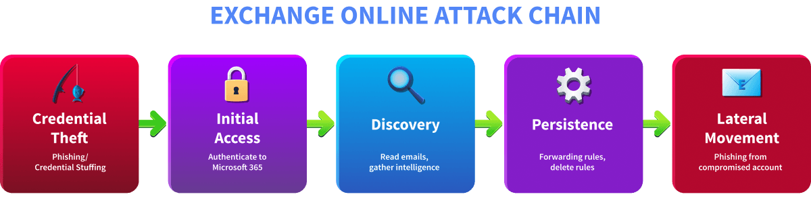

## Day 118
### [**Streak**](https://tryhackme.com/Tushig3531/streak)
---
**Room Completed**
[**Exchange Online Monitoring**](https://tryhackme.com/room/exchangeonlinemonitoring)
---

> Today, I am learning Microsoft Entra ID.

## Exchange Online Monitoring

**Exchange Online** is Microsoft's cloud based email and calendaring service, also known as Outlook.

**Common attack pattern in Exchange Online compromises:**



- **Credential Theft** : Before gaining access, the attacker first obtains valid credentials. Typically through phishing emails, credential stuffing attacks using leaked password databases, or purchasing stolen credentials from dark web marketplaces
- **Initial Access** : Using the stolen credentials, the attacker authenticates to Microsoft 365 and gains access to the victim's Exchange Online mailbox. This authentication is processed through Entra ID and leaves a trace in sign in logs
- **Discovery** : Once inside, the attacker explores the mailbox. They read emails to understand the organization, identify sensitive information, find other potential targets, and gather intelligence for further attacks
- **Persistence** : To maintain long term access even if the victim changes their password, the attacker sets up mechanisms to keep receiving data. This includes creating forwarding rules to silently copy incoming emails to an external address, or setting up inbox rules to delete specific emails so the victim stays unaware
- **Lateral Movement** : Finally, the attacker weaponizes the compromised account. By sending phishing emails from a trusted internal address, they can bypass email security filters and trick colleagues into clicking malicious links or revealing their own credentials

### Logs

**Sign in logs:**
```bash
index=* sourcetype="azure:aad:signin" appDisplayName="One Outlook Web"
| table _time userPrincipalName appDisplayName ipAddress location.city status.errorCode
| sort - _time
```

**Audit logs:**
```bash
index=* sourcetype="o365:management:activity" Workload=Exchange
| table _time UserId Operation Workload
```

- `Workload` field identifies which Microsoft 365 service generated the event
- `Operation` field tells you exactly what action was performed

| Operation | Description | Why It Matters |
|---|---|---|
| MailItemsAccessed | Someone accessed and read emails in the mailbox | Helps identify if an attacker has read sensitive emails after gaining access |
| Send | An email was sent from the mailbox | Detects phishing emails sent from a compromised internal account |
| New-InboxRule | A new inbox rule was created | Attackers create rules to delete replies or forward emails to hide their activity |
| Set-InboxRule | An existing inbox rule was modified | Attackers may modify existing rules to avoid detection instead of creating new ones |
| Set-Mailbox | Mailbox settings were changed, including forwarding | Used by attackers to configure silent email forwarding to an external address |
| Add-MailboxPermission | Delegate access was granted to another user | A common persistence method, attackers grant themselves access to return to the mailbox even after a password reset |

**Message trace logs:**
```bash
index=* sourcetype="o365:reporting:messagetrace"
| table Received SenderAddress RecipientAddress Subject Status FromIP
```

Message trace is a separate log source that tracks the full delivery journey of every email, including sender, recipient, subject, delivery status, and timestamp.

### Detecting Mailbox Rule Abuse

**Inbox Rules**
- `New-InboxRule` is logged when a new inbox rule is created
- `Set-InboxRule` is logged when an existing inbox rule is modified

- **Delete rules** : automatically delete incoming emails matching certain criteria
- **Forwarding rules** : automatically forward incoming emails matching specific conditions to an external address the attacker controls

**Investigate inbox rule creation:**
```bash
index=* Workload=Exchange Operation=New-InboxRule 
| table _time UserId Name DeleteMessage ForwardTo SubjectContainsWords
```

**Mailbox level** email forwarding applies to every single incoming email unconditionally.

**Investigate mailbox level email forwarding:**
```bash
index=* Workload=Exchange Operation=Set-Mailbox 
| table _time UserId ForwardingSmtpAddress DeliverToMailboxAndForward
```

**Delegate Access** : Attackers add themselves or another account they control as a delegate to the victim's mailbox, gaining persistent access even after the victim changes their password. Unlike forwarding rules, delegate access gives the attacker full interactive access to the mailbox, they can read, send, and manage emails as if they were the victim.

### Detecting Phishing From a Compromised Mailbox

`MailItemsAccessed` logs are generated whenever emails in a mailbox are accessed or read.

**Investigate mail items accessed:**
```bash
index=* Workload=Exchange Operation=MailItemsAccessed 
| table _time UserId ClientIPAddress OperationCount
```

**Investigate sent emails:**
```bash
index=* Workload=Exchange Operation=Send 
| table _time UserId Item.Subject ClientIP SaveToSentItems
```

**Key fields of Send:**

| Field | Description |
|---|---|
| UserId | The account that sent the email |
| Item.Subject | The subject line of the email sent |
| Item.SizeInBytes | Size of the email |
| ClientIP | IP address the email was sent from |
| SaveToSentItems | Whether the email was saved to Sent Items |

**Investigate message trace logs:**
```bash
index=* sourcetype="o365:reporting:messagetrace" 
| table Received SenderAddress RecipientAddress Subject Status FromIP
```

With message trace we can understand the full scope of a phishing campaign.


---

<!--  -->