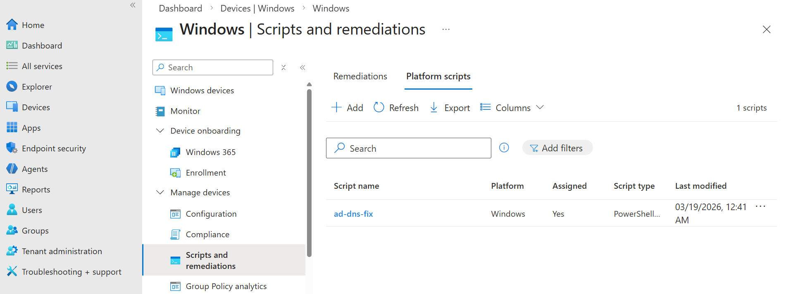
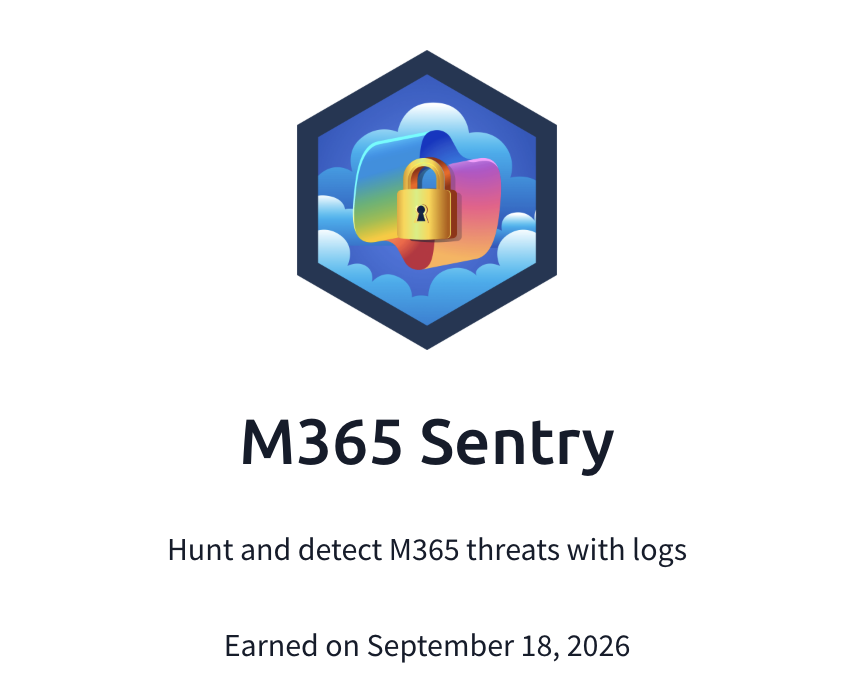

## Day 119
### [**Streak**](https://tryhackme.com/Tushig3531/streak)
---
**Room Completed**
[**SharePoint Online Monitoring**](https://tryhackme.com/room/sharepointonlinemonitoring)
[**Microsoft Intune Monitoring**](https://tryhackme.com/room/msintunemonitoring)

---

> Today, I am learning Microsoft Entra ID.
> Today, I am learning Microsoft Entra ID.

## SharePoint Online Monitoring

SharePoint Online is a service within the Microsoft 365 suite that lets you store, organize, share, and access corporate information through a web browser. Basically the business version of Google Drive or Microsoft OneDrive.

**SharePoint Risks:**
- IT sites may contain network diagrams, application source code, or even keys
- Finance sites may contain internal reports and confidential documents
- Sales sites typically contain big spreadsheets of partners and customers
- In short, SharePoint is one of the most important M365 services to monitor

### SharePoint Logging

A single SharePoint visit can generate several sign in events. We can find:
- Who shared, what they shared, and where
- Who accessed that file
- What device they used

**List SharePoint sharing events:**
```bash
index=* Workload=SharePoint Operation IN(AddedToSecureLink, AnonymousLinkCreated)
```
```bash
index=* Workload=SharePoint Operation IN(SecureLinkUsed, AnonymousLinkUsed)
```

**List Rclone downloads:**
```bash
index=* rclone Operation=FileDownloaded
| table _time UserId Operation ApplicationDisplayName ApplicationId UserAgent
```

### Detecting SharePoint Abuse

| # | Response Action | Splunk Search Example |
|---|---|---|
| 1 | Find and quarantine the malicious file that was shared | N/A (read the sharing email and note the file name inside) |
| 2 | Identify and disable patient zero, the user account that uploaded the file | `index=m365 Operation IN(FileUploaded, FileCreated) ObjectId=*BADFILE* \| table _time UserId Operation ObjectId` |
| 3 | Identify and notify all users the malicious file was shared with | `index=m365 Operation IN(AddedToSecureLink, SharingSet) ObjectId=*BADFILE* \| table _time UserId TargetUserOrGroupName ObjectId` |
| 4 | Immediately contact (e.g. call) those who already opened the file | `index=m365 Operation IN(*LinkUsed, FileAccessed) ObjectId=*BADFILE* \| stats values(UserId)` |

## Microsoft Intune Monitoring

**Microsoft Intune** is a cloud based Mobile Device Management (MDM) platform.

**Intune Capabilities:**
- Build an asset inventory of all corporate devices
- Push configuration policies to devices remotely
- Deploy and manage applications across the fleet
- Wipe devices in case of malware infection or physical theft
- Enforce compliance rules (e.g. require encryption or OS update)
- Integrate with Microsoft Entra ID (formerly Azure Active Directory)

**Intune Helps:**
- As an asset inventory database to get more information about a device
- To quickly patch or uninstall software during major supply chain incidents
- To apply policies, run security checks, or bulk install EDR/SIEM agents
- To isolate devices from the network or reimage the OS in case of theft

**Intune Portal:**

Organizes onboarded devices into groups and manages them from the Intune cloud console. From there we can define policies, deploy scripts, install apps, configure auto enrollment, and more.

Whenever a user logs into a cloud app via Entra ID, Microsoft includes device details in its audit logs.

### Risk

In the wrong hands, the Intune console can become a fully featured Command & Control server, or a weapon for mass destruction of corporate data.

**Intune Bulk Device Actions:**

Intune supports bulk actions across enrolled devices, including restart, rename, and wipe. With administrative access to the Intune console, any user can issue a wipe command against selected devices, across all platforms except Linux. The moment the agent receives the command, it immediately resets the device to factory settings, erasing local data.

**Monitoring Remote Wipes:**

There is no way to monitor a mass device wipe via Intune in time, because by the time we receive the alert, everything would already be wiped.

The first stage is detecting logins to the Intune portal. At minimum, we should alert on logins by Intune administrators from unmanaged devices, suspicious IPs, or outside working hours. Regular Entra ID sign-in logs record every Intune login with `appDisplayName` set to "Microsoft Intune portal extension".

**Detect Intune logins from unmanaged devices:**
```bash
index=intune sourcetype=azure:aad:signin appDisplayName=*Intune* deviceDetail.displayName=""
| rename deviceDetail.* as dvc.*
| table _time appDisplayName ipAddress dvc.isManaged dvc.isCompliant dvc.displayName user
```

**Detect remote wipes** (note: custom sourcetype):
```bash
index=intune sourcetype="o365:graph:intune" wipe
| eval deviceid=mvindex('resources{}.modifiedProperties{}.newValue', 0)
| table _time activityType actor.userPrincipalName deviceid
```

### Intune Risks: Apps and Scripts

The platform also lets administrators deploy custom scripts (Platform scripts), such as PowerShell, and execute them under the context of the logged in user or the local SYSTEM account. Platform scripts let IT push one time commands in bulk, useful for tasks not covered by built in templates and configuration policies.



**Script lifecycle has four stages:**
1. Script is **created** in the Intune console
2. **Assigned** to selected devices
3. **Executed** on the devices (not logged)
4. **Deleted** from Intune by IT at some point

We can see these stages in SIEM starting from the query `activityType=*DeviceManagementScript*`.

**Detect platform scripts** (note: custom sourcetype):
```bash
index=intune sourcetype="o365:graph:intune" activityType=*DeviceManagementScript*
| eval action=mvindex(split(activityType, " "), 0)
| eval script='resources{}.resourceId'
| eval target=mvindex('resources{}.modifiedProperties{}.newValue', 0)
| eval target=if(action="assignDeviceManagementScript", target, "N/A")
| table _time actor.userPrincipalName action script target
```

A more advanced attack scenario is packaging malware inside an app, compiled into the `.intunewin` format using a Microsoft tool, or classic `.dmg`/`.pkg` for macOS.
- Intune can then deploy the compiled application to selected devices with the highest privileges, even if the app isn't signed by a trusted authority
- For threat actors, this opens a range of possibilities, from ransomware and cryptocurrency miner deployment to data exfiltration at scale

**Detect application events** (note: custom sourcetype):
```bash
index=intune sourcetype="o365:graph:intune" activityType=*MobileApp*
```

---

