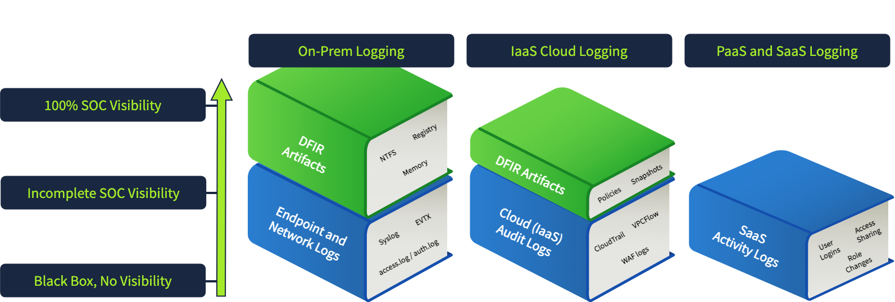

## Day 120
### [**Streak**](https://tryhackme.com/Tushig3531/streak)
---
**Room Completed**
[**Cloud Security Pitfalls**](https://tryhackme.com/room/cloudsecuritypitfalls)
---

> Today, I am learning Cloud Security.

### Service Models

**IaaS (Infrastructure as a Service)** : a cloud service model where computing infrastructure is provided online on demand. With an IaaS provider like Amazon AWS, Google Cloud, or Microsoft Azure, you can launch any lab machine in the cloud without worrying about power outages and hardware failures.

**PaaS (Platform as a Service)** : for when software developers don't want to bother with launching lab machines, all they want is to write the source code, click a button, and see their application up and running, without caring much how and where it actually runs. PaaS covers this: a cloud service model for simple development and hosting of web applications.
- Vercel, Heroku, Netlify, and Google App Engine

**SaaS (Software as a Service)** : allows users and companies to launch complex applications in the cloud without installing any software on their own computers.
- Slack, Zoom, Gmail, Dropbox, GitHub, and Google Docs

### Security of the Cloud

Basically shared responsibility, both sides need to stay safe. If an incident happens in the infrastructure, the provider should take care of it. But if anything happens to my application, I should take care of it.

It feels like a city. I have my own shop in the city of AWS. If a thief steals my goods, I should be the one being cautious and preventing it. But if a war happens and the district or the whole city is getting attacked, the city should be the one being cautious and preventing that attack.

And same as with a city, we can't get the full detail of an attack from the city commission. So we can't get incident reports or logs from the IaaS provider either.

Big providers like AWS are rarely breached, but when it happens, attackers usually go after their biggest customers. Treat the provider as a supply chain risk: don't trust it blindly, and keep doing our own defense (segment the network, watch login activity, monitor endpoints).

We can't monitor what we can't see, so focus on what we control: which vendors we pick, what data we give them, who has access, and tracking which SaaS apps are in use.

- **On our own network** : we control the machines, so we install an agent and collect every log we want
- **In the cloud** : we can't put an agent on the provider's infrastructure, especially in SaaS. We only get the logs they offer, like AWS CloudTrail. Those logs are often limited: we may have to pay extra for them, the fields may be messy or undocumented, or the service may not send logs to a SIEM at all

### Cloud Security Monitoring

How hard cloud monitoring is depends on the service model. The more of the stack we control, the more we have to monitor.

**SaaS** is the easiest. We pull the provider's logs into our SIEM through its API and watch for risky actions.

**IaaS** is harder because we cover three layers:
- **Workloads** : our VMs and containers, monitored like normal servers
- **Cloud services** : things like database queries and storage access
- **Control plane** : logins and actions in the cloud admin console

Data sources change too. In our own network we use EDR, SIEM, and forensic tools. In the cloud:
- EDR often doesn't work, since containers and auto scaling make machines appear and disappear
- Connecting the provider's logs to our SIEM can be difficult
- Forensics is limited, since we can't access memory or disk directly

- **SaaS** : easy to set up, but we get the fewest logs. We only pull what the provider offers through its API. Little to build, but also little visibility, and we can't add more
- **IaaS** : harder to set up, but we get more logs. More layers to cover (workloads, cloud services, control plane), and we can install our own agents on our own VMs. More work, but more visibility

### Cloud Security Tools

- **Cloud Access Security Brokers (CASB)** : enforces security policies
- **Cloud Workload Protection Platforms (CWPP)** : protects workloads from malware
- **Cloud Security Posture Management (CSPM)** : alerts on misconfigurations

These tools help, but a SIEM alone can still give decent coverage if we follow six steps:

1. **List our clouds** : know where our important data lives
2. **Know the risks** : have a plan in case a vendor gets breached
3. **Enable cloud logs** : turn on the provider's audit logs everywhere, including SaaS
4. **Enable workload logs** : VMs need the same logging as normal servers
5. **Collect the logs** : send them to our SIEM, since clouds don't keep them long
6. **Monitor for anomalies** : write alert rules for suspicious logins and admin actions

---

<!--  -->